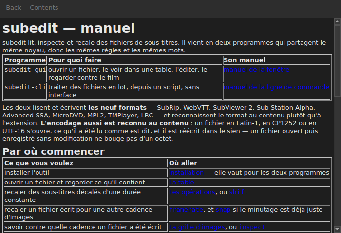

# Le manuel dans la fenêtre

`Help ▸ Manual`, ou `F1`, ouvre **ce manuel-ci** dans une fenêtre à lui.




## Ce qu'il ouvre, et pourquoi pas une adresse

**Le manuel installé à côté du programme**, et non une page sur Internet.

Une adresse décrirait la version en cours de développement, pas celle qu'on a
sous la main. Un utilisateur qui lit le manuel d'une version qu'il n'a pas est
moins bien servi qu'un utilisateur sans manuel — c'est pourquoi la fenêtre lit
les fichiers déposés par l'installation, sous
`<préfixe>/share/subedit/manual`. Voir [Installation](../subedit-cli/installation.md).

Il s'ouvre sur la [page d'accueil](../index.md), celle qui dit par où commencer.

## Naviguer

| Ce qu'on fait | Ce qui se passe |
| :------------ | :-------------- |
| cliquer un lien du manuel | la page s'ouvre dans la même fenêtre |
| cliquer un lien qui vise une section | la page s'ouvre, et la fenêtre y descend |
| cliquer un lien qui ne vise qu'une section | la fenêtre y descend, sans changer de page |
| `Back` | revient à la page précédente ; éteint sur la première |
| `Contents` | revient à la page d'accueil ; éteint quand on y est |

La fenêtre **n'est pas modale** : elle reste ouverte pendant qu'on travaille,
ce qui est tout l'intérêt d'avoir le manuel sous la main. Rouvrir l'entrée ne
crée pas une seconde fenêtre, elle ramène celle-ci devant.

## Ce qu'il ne peut pas ouvrir, et il le dit

Le manuel renvoie parfois à la **feuille de route** ou à une **décision
d'architecture**. Ce sont des documents du dépôt, pas du paquet : ils ne sont
pas installés, et la fenêtre l'écrit en toutes lettres plutôt que de laisser le
clic sans effet.

```
../../feuille-de-route.md is not part of the installed manual;
it lives in the project's repository.
```

Ils se lisent sur le dépôt, dont l'adresse est dans `Help ▸ About subedit`.

## Quand l'entrée est éteinte

**`Help ▸ Manual` est éteinte quand il n'y a pas de manuel à côté du
programme.** Deux cas, et aucun n'est une panne :

| Cas | Pourquoi |
| :-- | :------- |
| le binaire est lancé depuis son arbre de construction | rien n'y a été installé, donc rien n'y est à lire |
| l'installation est partielle | le manuel a été retiré, ou n'a jamais été copié |

Survoler l'entrée dit lequel des deux : « No manual is installed beside this
program ».

Une page manquante alors que le manuel est là — un fichier effacé à la main —
ne referme pas la fenêtre : elle nomme le fichier qu'elle n'a pas pu lire et
garde à l'écran ce qu'elle montrait.

## Où le manuel est cherché

**À côté de l'exécutable**, dans `../share/subedit/manual` — la disposition que
toute installation produit, quel que soit le préfixe. C'est ce qui fait qu'une
installation sous `~/.local` trouve son manuel aussi bien qu'un paquet installé
sous `/usr`.
