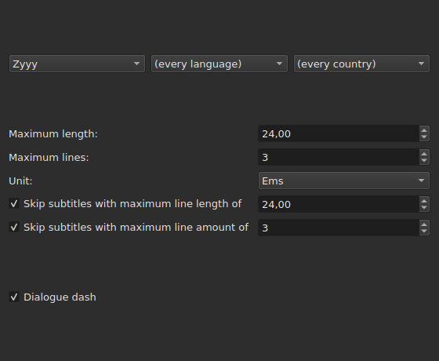
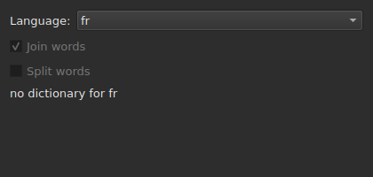
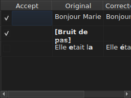

# Correct Texts…

`Tools ▸ Correct Texts…` ouvre un assistant à plusieurs pages, sur le modèle de
celui de Gaupol : une page de cible et de tâches, une page par tâche cochée,
une page de progression, et une page de confirmation qui propose les
changements sans jamais les imposer.

**Éteinte sur un document vide** : il n'y a rien à corriger.

**La ligne de commande fait la même chose** pour toutes les tâches : [`subedit-cli correct`](../subedit-cli/correct.md), avec les
mêmes motifs et les mêmes comptes, mais sans rien lire des réglages de cette fenêtre — et en
caractères là où la fenêtre mesure en ems.

## Tasks and Target — la première page

| Groupe | Choix | Par défaut |
| :----- | :---- | :--------- |
| `Target` | `Selection`, `Current Project`, `All Open Projects` | `Current Project` |
| `Document` | `Text`, `Translation` | `Text` |
| `Tasks` | `Mentions`, `Join or Split Words`, `Common Errors`, `Capitalization`, `Line Break` — à cocher, un ou plusieurs | `Common Errors` et `Capitalization` cochées, les trois autres non |

`Selection` est éteinte sans ligne choisie dans l'onglet montré ; `Translation`
est éteinte tant qu'aucun projet ouvert ne porte de traduction.

**La cible et le document ne se retiennent pas** : l'assistant rouvre toujours
sur `Current Project` et `Text`. Les tâches cochées, elles, se retiennent.

**Ce que chaque cible désigne** :

| Cible | Porte sur |
| :---- | :-------- |
| `Selection` | les lignes choisies dans l'onglet montré |
| `Current Project` | tout le fichier de l'onglet montré |
| `All Open Projects` | tout le fichier de chaque onglet ouvert |

**`All Open Projects` sur `Translation` saute les projets sans traduction** :
un projet qui n'en porte pas n'a rien à proposer dans une colonne vide, et
l'assistant ne le compte pas.

**Les pages de tâche suivent, dans l'ordre de Gaupol — `Mentions`, `Join or
Split Words`, `Common Errors`, `Capitalization`, `Line Break` — jamais celui dans lequel les cases
ont été cochées.** Une tâche non cochée n'a pas de page ; ses réglages
retenus ne changent pas pour autant. **Aucune page de tâche ne porte sa propre
case « active »** : c'est celle de cette première page, et elle seule, qui
décide si la tâche s'exécute.

## Les pages de tâche

Chacune des quatre pages de motifs — toutes sauf `Join or Split Words`, qui n'en a pas — porte la même base : trois menus déroulants en
cascade — écriture, langue, pays — pour choisir le code des motifs à
appliquer, puis la liste des motifs de ce code, un à cocher par nom. **Les
trois menus ne proposent que ce que le catalogue de motifs porte
effectivement** — ceux livrés avec le programme et ceux qu'un utilisateur y a
déposés (voir [Les motifs déposés](#les-motifs-déposés)) — jamais une liste
de langues ou de pays lue ailleurs. `Zyyy` (« toute écriture ») est le code de
départ de `Common Errors`, ce qui donne les motifs valables partout. **Les trois
autres types n'ont de motifs que sous une écriture** : leur page s'ouvre sur la
première que le catalogue propose, `Latn` avec les motifs livrés, et non sur `Zyyy`.

**Un motif décoché reste décoché tant qu'on ne le recoche pas**, y compris en
changeant de code puis en y revenant, et ce choix est retenu d'une ouverture
de l'assistant à l'autre. Recoché, il retrouve simplement son réglage
d'origine, et le choix retenu disparaît.

| Page | Ce qu'elle ajoute à la base |
| :--- | :-------------------------- |
| `Mentions` | deux cases, `Sound in brackets` et `Sound in parentheses`, non cochées par défaut |
| `Common Errors` | deux cases, `Human` et `OCR`, cochées par défaut |
| `Capitalization` | rien de plus |
| `Line Break` | une longueur maximale (`24`, par défaut), un nombre de lignes maximal (`3`), une unité — `Characters` ou `Ems`, `Ems` par défaut —, et deux conditions de saut, décrites plus bas |

**Les deux cases de `Mentions` ne nomment aucun motif compilé** : elles
commandent un balayage du texte au noyau, celui que
[`Remove Hearing-Impaired Mentions…`](operations.md#remove-hearing-impaired-mentions)
fait déjà d'un geste direct. L'une **ou** l'autre cochée suffit à le lancer. **La liste des motifs de la page ne les répète pas** : ces deux noms n'y figurent qu'une fois, sous forme de case.

**`Common Errors` filtre par classe** : un motif qui porte les deux classes
s'applique dès que l'une des deux cases est cochée ; les trois autres pages ne
connaissent pas cette distinction.

### Line Break — l'unité et le saut




| Réglage | Ce qu'il fait | Défaut |
| :------ | :------------ | :----- |
| `Maximum length` | la longueur d'une ligne, dans l'unité choisie ; de `1` à `1000` | `24` |
| `Maximum lines` | le nombre de lignes visé ; de `1` à `100` | `3` |
| `Unit` | `Characters` compte les caractères ; `Ems` mesure la largeur avec la police de la fenêtre, où une lettre minuscule moyenne vaut `0,55` — l'unité de Gaupol | `Ems` |
| `Skip subtitles with maximum line length of` | laisse tel quel un sous-titre dont la ligne la plus longue tient dans cette longueur, dans l'unité choisie | cochée, `24` |
| `Skip subtitles with maximum line amount of` | laisse tel quel un sous-titre dont le nombre de lignes tient dans ce nombre | cochée, `3` |

**Le saut a ses propres seuils**, distincts des limites visées : c'est la
règle de Gaupol. Un sous-titre est laissé tel quel s'il tient dans **tous les
seuils dont la case est cochée** ; sinon il est découpé, et le découpage n'est
gardé que s'il rapproche le sous-titre d'un seuil qu'il dépassait — moins de
longueur, ou moins de lignes. Aucune case cochée : tout sous-titre est découpé,
qu'il tienne déjà ou non.

**Changer l'unité change ce qui est proposé** : la longueur de chaque ligne est
mesurée à chaque calcul, dans l'unité de la page à ce moment-là, et rien ne
subsiste d'une mesure précédente. Un texte de vingt-neuf caractères, dont
la moitié en lettres étroites, dépasse `24` en `Characters` et le tient largement
en `Ems`.

**Les sept réglages se retiennent** d'une session à l'autre, unité comprise.

### Join or Split Words — recoller et scinder d'après le correcteur




Une page à part, entre `Mentions` et `Common Errors`, pour réparer ce que les
logiciels de reconnaissance de texte font aux espaces. Elle n'a pas de liste de
motifs : elle s'appuie sur les dictionnaires du système, par Enchant.

| Réglage | Ce qu'il fait | Défaut |
| :------ | :------------ | :----- |
| `Language` | la langue du dictionnaire ; les codes que le système propose, et celui déjà choisi | la langue du système, si elle y est |
| `Join words` | recolle un mot mal orthographié au mot voisin | cochée |
| `Split words` | coupe un mot mal orthographié en deux | non cochée |

**Recoller** : un mot mal orthographié est joint au mot qui le précède ou qui
le suit **si, et seulement si, une seule des deux directions donne un mot bien
orthographié**. Quand les deux le donnent, ou qu'aucune, rien n'est fait.
`bon jour` devient `bonjour` ; deux espaces d'affilée sont d'abord ramenés à
un, mais un texte où rien n'est recollé est rendu tel qu'il était, espaces
comprises.

**Scinder** : un mot mal orthographié est coupé si, parmi les suggestions du
correcteur, **une seule** est ce mot avec une espace dedans — les mêmes
lettres, dans le même ordre. Deux suggestions de cette sorte, ou aucune : rien
n'est fait. Un mot dont seule l'initiale est en capitale (`Bonjourtous`) n'est
jamais scindé : c'est souvent un nom, et les dictionnaires n'en ont pas.

**La liste de remplacements de l'utilisateur** (`spell-check/<langue>.repl`,
dans le répertoire de configuration du programme) compte parmi les suggestions
du correcteur ; l'assistant la lit et ne l'écrit pas.

**Sans dictionnaire pour la langue choisie, la page reste et se grise** : les
deux cases sont éteintes et la page dit `no dictionary for` suivi du code de
la langue. La langue reste modifiable — un dictionnaire d'une autre peut être
là — et la tâche, cochée ou non sur la première page, ne fait alors rien et ne
signale aucune erreur.

**La langue, les deux cases et la case de la première page se retiennent** d'une
ouverture de l'assistant à l'autre.

### Les motifs déposés

Un motif qu'un utilisateur a déposé dans son propre répertoire de motifs
s'ajoute à ceux livrés avec le programme, dans le même catalogue et sous les
mêmes menus — rien ne les distingue une fois chargés.

| Motifs | Où |
| :----- | :-- |
| livrés | `<préfixe>/share/subedit/patterns`, à côté de `<préfixe>/bin` |
| de l'utilisateur | `$XDG_DATA_HOME/subedit/patterns`, ou `~/.local/share/subedit/patterns` si la variable n'est pas posée ou n'est pas un chemin absolu |

**Le format est celui de Gaupol, lu tel quel** : un fichier `<Code>.<type>` par écriture,
langue et pays — `Latn-en.common-error` —, son `.conf` d'activation à côté. Les types
sont `common-error`, `capitalization`, `hearing-impaired` et `line-break`. Les fichiers
livrés servent de modèle. **Les motifs se lisent une fois, au lancement** : un fichier
déposé pendant que la fenêtre est ouverte n'est vu qu'au lancement suivant.

## Progress

Une fois `Next` pressé depuis la dernière page de tâche cochée (ou depuis la
première page si aucune tâche ne l'est), l'assistant calcule les corrections
proposées sur un fil d'arrière-plan, une barre de progression indéterminée à
l'écran. Le calcul fini, la page de confirmation s'ouvre d'elle-même.

**`Cancel` à cette étape abandonne le calcul sans l'interrompre** : rien
n'est appliqué, mais l'assistant attend, pour se fermer, que le calcul en
cours se termine — une attente bornée par la limite de temps que le moteur
de motifs impose à chaque recherche.

**`Back` à cette étape revient à la page précédente sans attendre** : le calcul
se termine en arrière-plan et son résultat est écarté — l'assistant ne saute
pas de lui-même à la confirmation. `Next` relance un calcul neuf.

## Confirmation — la dernière page




Une ligne par texte que l'assistant changerait — jamais une ligne pour un
texte qu'une tâche a laissé tel quel.

| Colonne | Ce qu'elle montre |
| :------ | :----------------- |
| `Accept` | une case, cochée par défaut : la correction sera appliquée ou non |
| `Original` | le texte tel qu'il est, sa partie qui changerait **en gras** |
| `Corrected Text` | le texte proposé, sa partie changée en gras, **éditable** — le retoucher change ce qui sera écrit, sans changer la case `Accept` |

**Le changement est marqué en gras, jamais en couleur** : la même diff se lit
dans les deux palettes sans dépendre d'aucune teinte.

**Une ligne dont la proposition est une suppression** — le sous-titre n'aurait
plus de texte — montre la colonne `Corrected Text` vide, et son `Original` entier en
gras.

| Bouton | Ce qu'il fait |
| :----- | :------------- |
| `Mark All` | coche `Accept` sur toutes les lignes |
| `Unmark All` | décoche `Accept` sur toutes les lignes |
| `Preview` | place le lecteur intégré sur le sous-titre de la ligne choisie, si le projet a un film — rien s'il n'en a pas |
| `Finish` | applique les lignes cochées et ferme l'assistant |

`Remove all blank subtitles`, cochée par défaut, retire les sous-titres
qu'une correction laisserait sans aucun texte plutôt que de les garder vides.

**Un motif que le calcul n'a pas pu appliquer est nommé sous la table**, avec
la raison :

```text
Not applied: some pattern (will not compile)
```

Un motif nommé ainsi l'est **une fois par raison**, quel que soit le nombre de
textes ou de projets sur lesquels il a échoué : l'écran ne dit pas lequel.

| Raison | Ce qui la déclenche |
| :----- | :------------------ |
| `cannot be translated` | l'expression emploie ce que la traduction de la syntaxe de Python refuse |
| `will not compile` | le moteur refuse l'expression |
| `has an invalid replacement` | le remplacement ne se lit pas comme Python le lit |
| `timed out` | une recherche a dépassé le temps que le moteur lui accorde sur un texte |
| `never settled` | `Repeat` changeait encore le texte après cent passes |
| `grew the text too long` | le texte a dépassé 16 384 octets pendant que le motif y travaillait |

**Un motif qui échoue sur un texte le laisse tel qu'il était avant lui** : un remplacement
à moitié fait vaut moins que pas de remplacement. Les autres motifs s'appliquent.

**Une ligne d'un fichier de motifs qui ne se lit pas est nommée au même
endroit**, par son fichier, sa ligne et la raison — à chaque ouverture de
l'assistant, puisque les motifs ne sont lus qu'une fois, au lancement :

```text
Could not be read: Zyyy.common-error, line 8 (malformed line)
```

| Raison | Ce qui la déclenche |
| :----- | :------------------ |
| `directory cannot be read` | le répertoire des motifs livrés n'a pas pu être parcouru |
| `file cannot be read` | un fichier de motifs n'a pas pu être lu |
| `malformed line` | une ligne qui n'est ni un en-tête, ni un commentaire, ni `Clé=Valeur` |
| `field outside any pattern` | un `Clé=Valeur` avant le premier en-tête de motif |
| `unknown field` | une clé dont ce type de motif n'a pas l'usage — le motif est gardé |
| `missing field` | une clé sans laquelle ce type de motif ne peut rien — le motif est écarté |
| `invalid value` | une valeur que la clé n'accepte pas — le motif est écarté |
| `malformed activation` | un élément `<pattern>` d'un `.conf` qui ne nomme rien |

Les autres motifs, ceux qui se sont bien lus et bien appliqués, ne sont pas
concernés.

## Ce qu'annuler dit, et ce qu'`Cancel` ne fait jamais

**`Finish` fait une entrée d'historique par projet touché**, jamais une par
correction : `Undo` défait d'un coup toutes les corrections acceptées sur ce
projet, chacune avec le texte qu'elle avait. Le menu la nomme
`Undo: correcting texts`.

La barre d'état dit le compte, les textes changés d'abord, les sous-titres
retirés ensuite :

```text
Edited 3 and removed 1 subtitles
```

**`Cancel`, à n'importe quelle page, n'applique rien et ne retient rien** — ni
les réglages choisis pendant cette ouverture, ni la moindre correction. La
prochaine ouverture de l'assistant repart des réglages d'avant.

## Un exemple

Un fichier ouvert porte deux espaces entre deux mots d'une réplique et une
mention entre crochets sans autre texte. `Tools ▸ Correct Texts…`, `Common
Errors` déjà coché, `Next` jusqu'à la confirmation : la ligne des deux espaces
montre `Bonjour  Marie` à gauche, `Bonjour Marie` à droite, la correction en
gras et déjà acceptée. `Finish` l'applique, et la barre d'état dit :

```text
Edited 1 and removed 0 subtitles
```
