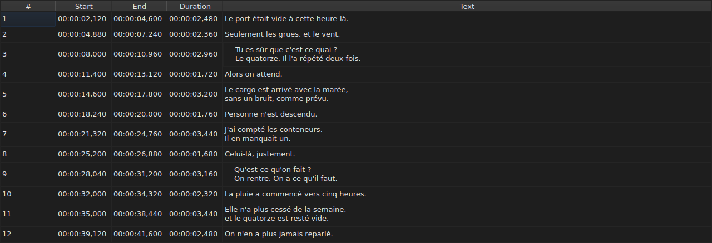

# Éditer une cellule

Trois colonnes s'éditent en place : `Start`, `End` et `Text`. `#` et `Duration`
ne s'éditent pas — le numéro est le rang de la ligne, la durée est
`Fin − Début`, et ni l'un ni l'autre n'est une donnée du fichier.

**Ouvrir l'éditeur d'une cellule :** double-cliquer dessus, ou la sélectionner
et appuyer sur `F2`.

## Le texte

L'éditeur est un champ **multiligne**, et il s'ouvre à la hauteur du sous-titre :
un sous-titre de deux lignes s'y saisit tel qu'il sera écrit, ses deux lignes
lisibles et sans ascenseur. Un `Maj+Entrée` qui en ajoute une agrandit
l'éditeur ; la ligne de la table s'ajuste à la validation.

| Touche | Effet |
| :----- | :---- |
| `Entrée` | valide et referme l'éditeur |
| `Maj+Entrée` | insère un saut de ligne dans le texte |
| `Échap` | referme l'éditeur ; la cellule garde ce qu'elle avait |
| `Tab` | valide et passe à la cellule suivante |

Cliquer ailleurs valide aussi : la perte du focus vaut `Entrée`.

## Le début et la fin

L'éditeur est un champ d'une ligne, **contraint à la forme d'un horodatage** :
il refuse à la frappe ce qui ne pourrait jamais en être un.

Les formes acceptées sont celles que la lecture d'un fichier accepte déjà :

| Élément | Ce qui passe |
| :------ | :----------- |
| champs | `MM:SS` ou `HH:MM:SS`, un ou deux chiffres chacun |
| décimales | une à trois, après une virgule ou un point, ou aucune |
| signe | un `-` en tête, pour une position avant le début de la vidéo |
| bornes | minutes et secondes inférieures à 60 |

`00:01:02,500`, `1:02.5` et `-0:01,000` sont donc trois saisies valides.

**Une saisie que la lecture refuse laisse la cellule inchangée.** C'est le cas
de `00:70:00,000`, dont la forme est bonne mais dont les minutes sortent des
bornes : l'éditeur se referme et rien n'a bougé. Aucune position n'est inventée
— se tromper de position est silencieux, rien à l'écran ne distingue un
sous-titre mal calé d'un sous-titre bien calé.

Modifier un début ou une fin met la `Duration` à jour aussitôt.

## Une validation qui ne change rien ne fait rien

Ouvrir une cellule, ne rien taper, appuyer sur `Entrée` : il ne se passe rien.
Aucune modification n'est enregistrée, et le fichier reste réputé identique à
celui du disque.

La comparaison porte sur la **position**, pas sur la chaîne : saisir `0:01.0`
dans une cellule qui affiche `00:00:01,000` désigne le même instant, et ne
change donc rien non plus.

## Ce qu'une cellule éditée devient

Elle **s'annule** — une cellule, une entrée. Voir
[Annuler et rétablir](annulation.md).

Elle **s'enregistre**, et fermer la fenêtre sans l'avoir fait demande
confirmation. Voir [Ouvrir et enregistrer](fichiers.md).
