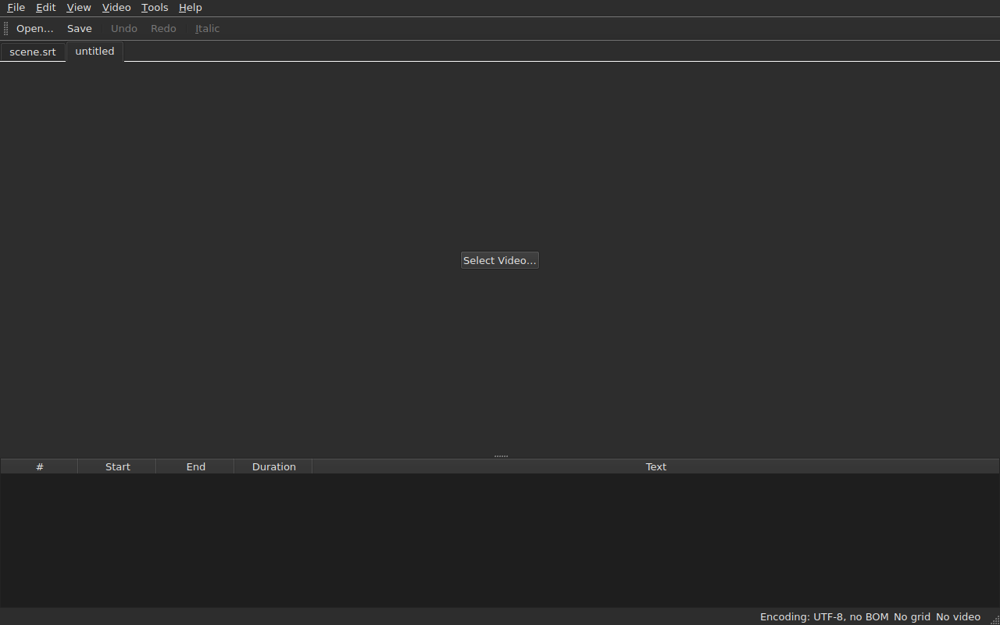
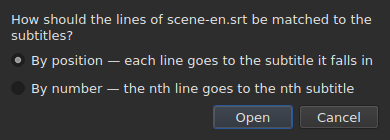
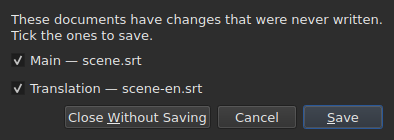

# Ouvrir et enregistrer

Le menu **File** porte les trois commandes, deux pour les onglets, et trois de
plus pour la traduction.

| Commande | Raccourci | Ce qu'elle fait |
| :------- | :-------- | :-------------- |
| `New` | `Ctrl+N` | un projet vide, dans un nouvel onglet |
| `Open…` | `Ctrl+O` | choisit un fichier et l'ouvre dans un nouvel onglet |
| `Open Translation…` | — | choisit un fichier de traduction et l'aligne sur le principal de l'onglet courant |
| `Save` | `Ctrl+S` | réécrit le fichier ouvert |
| `Save As…` | `Ctrl+Shift+S` | choisit un chemin et un format, puis écrit |
| `Save Translation` | — | réécrit le fichier de la traduction |
| `Save Translation As…` | — | choisit un chemin et un format pour la traduction, puis écrit |
| `Close` | `Ctrl+W` | ferme l'onglet courant — éteinte s'il n'y en a qu'un |

`Open…` et `Save` sont aussi dans la barre d'outils. **Les trois entrées de la
traduction ne sont pas dans la barre** : elles ne servent qu'à ceux qui ont une
traduction, et la barre est celle de tout le monde.

## Plusieurs projets, en onglets

**Chaque projet ouvert a son onglet**, au-dessus de l'image et de la table :
son étiquette est le nom du fichier, ou `untitled` pour un projet qui n'en a
pas encore. Cliquer un onglet y bascule ; `Ctrl+PageDown` et `Ctrl+PageUp` font
de même, sans la souris, et reviennent au premier onglet après le dernier.




**`Open…` n'y touche jamais.** Ouvrir un fichier ne remplace plus ce que la
fenêtre montrait : il arrive dans un onglet neuf, à côté, et l'onglet qu'on
regardait avant garde tout ce qu'il avait — son historique, sa sélection, sa
vidéo associée. C'est aussi pourquoi ouvrir ne demande plus rien : il n'y a
rien à perdre, puisqu'il n'y a rien à remplacer.

**Un fichier déjà ouvert n'est pas ouvert une seconde fois.** `Open…` sur un
fichier qu'un autre onglet tient déjà rend le focus à cet onglet, et le dit
dans la barre d'état :

```text
premier.srt: already open
```

**Chaque onglet est un projet entier, indépendant des autres** : son
historique, sa sélection, sa vidéo associée et ce que sa dernière lecture a
rencontré ne sont montrés que quand cet onglet est le courant, et ne
changent pas pendant qu'un autre l'est. **Une exception, et elle est dans l'ADR
0033** : le lecteur vidéo est unique pour toute la fenêtre — un seul processus
mpv — et son film change avec l'onglet ; **la position de lecture ne survit pas
à un changement d'onglet**. Le presse-papiers, lui, est à la fenêtre : copier
dans un onglet et coller dans un autre est ce pour quoi on en ouvre deux.

**`Close` ferme l'onglet courant**, en posant s'il le faut
[la question des modifications non enregistrées](#les-modifications-non-enregistrées) —
celle de cet onglet seul, les autres n'étant pas concernés. **Éteinte quand il
n'y a qu'un onglet** : la fenêtre en garde toujours au moins un, et le fermer
serait fermer la fenêtre — ce que fait déjà le bouton du système.

**Fermer la fenêtre pose la question, onglet par onglet.** Chacun des projets
modifiés est demandé à son tour, dans l'ordre où ils ont été ouverts ; le
premier `Cancel` arrête tout, et aucun onglet n'est fermé. Une seule question
pour tous les onglets à la fois n'est pas encore là — elle attend `Save All` et
`Close All`.

## Ouvrir

Le dialogue filtre **les neuf formats lus**, une entrée chacun, et une première
entrée qui les montre tous. Le format est ensuite reconnu **au contenu, pas à
l'extension** : un `.txt` qui contient du SubRip s'ouvre, et le filtre ne décide
rien — il ne fait que cacher des fichiers.

| Entrée du filtre | Extension |
| :--------------- | :-------- |
| `SubRip` | `.srt` |
| `WebVTT` | `.vtt` |
| `SubViewer 2` | `.sub` |
| `Sub Station Alpha` | `.ssa` |
| `Advanced SSA` | `.ass` |
| `MicroDVD` | `.sub` |
| `MPL2` | `.txt` |
| `TMPlayer` | `.txt` |
| `LRC` | `.lrc` |

**Deux extensions désignent deux formats chacune** — `.sub` est SubViewer 2 et
MicroDVD, `.txt` est MPL2 et TMPlayer. C'est sans conséquence à l'ouverture,
puisque c'est le contenu qui tranche ; à l'enregistrement, c'est le **nom** de
l'entrée choisie qui dit le format, jamais son motif.

**Un fichier illisible ne remplace rien.** Absent, refusé par le système, écrit
dans un encodage sous lequel ses octets ne se décodent pas, ou d'aucun format
connu : une modale **nomme la cause**, et la fenêtre garde ce qu'elle avait,
sous-titres, historique et modifications comprises.

| Message | Ce qui s'est passé |
| :------ | :----------------- |
| `does not exist` | le chemin ne désigne aucun fichier |
| `cannot be opened: permission denied` | le système refuse de l'ouvrir |
| `cannot be read` | le système a refusé pour une autre raison |
| `cannot be decoded in the chosen encoding` | les octets ne se lisent pas dans l'encodage retenu |
| `is in no format this tool knows` | aucun format ne reconnaît le contenu |
| `holds nothing recognisable as a subtitle` | le format est reconnu, mais rien n'y est un sous-titre |

Le message est précédé du chemin : `notes.txt: is in no format this tool knows`.
Ce sont les mots de la ligne de commande, et ce n'est pas un hasard — les deux
surfaces lisent un fichier par la même recette.

Ouvrir depuis la ligne de commande fonctionne toujours : `subedit-gui film.srt`.
Là, la même raison est écrite sur la sortie d'erreur, et la fenêtre s'ouvre
vide — voir [Invocation](invocation.md#quand-louverture-échoue).

## Les diagnostics d'une lecture

Un fichier réel est rarement parfait, et la lecture s'en remet plutôt que
d'abandonner : un numéro absent, une ligne qui ne va nulle part, des fins de
ligne mélangées. **Ce qu'elle a rencontré s'affiche sous la table**, dans un
panneau replié qui s'ouvre d'un clic.

```
line 5: a SubRip block without its number, settled by the reader
```

Chaque ligne porte **le numéro de ligne du fichier** — celui qu'un éditeur de
texte montrerait —, ce qui a été rencontré, et ce qui en a été fait. Un extrait
du fichier suit entre guillemets quand il apporte quelque chose ; il est tronqué
au-delà de quatre-vingts caractères.

**Une seule ligne n'a pas de numéro**, celle de l'encodage : il a été proposé en
pesant les octets, avant qu'une seule ligne du fichier existe.

```
an encoding nothing declared ("windows-1252"), settled by the reader
```

Elle ne s'affiche que lorsque l'encodage a été **deviné et n'est pas de
l'UTF-8** — un fichier UTF-8 lu comme tel n'est pas un événement, et le dire à
chaque ouverture mettrait un panneau sous la table de tous les documents
ordinaires. Un fichier qui porte une marque d'ordre des octets ne la déclenche
pas non plus : il a déclaré son encodage, rien n'a été deviné.

Le panneau **n'apparaît pas** quand la lecture n'a rien à signaler.

## L'encodage dans la barre d'état

**La barre d'état dit toujours l'encodage du document ouvert**, à gauche de ce
qu'elle dit de la [grille d'images](grille.md) et de la
[vidéo associée](video.md) :

| Situation | Ce qui est écrit |
| :-------- | :--------------- |
| le fichier a été lu en UTF-8, sans marque | `Encoding: UTF-8, no BOM` |
| … avec une marque | `Encoding: UTF-8, BOM` |
| un fichier en Latin-1 | `Encoding: ISO-8859-1, no BOM` |

**Le diagnostic et cette ligne ne répondent pas à la même question**, et c'est
pourquoi les deux existent. Le diagnostic dit ce que la lecture **a fait** — elle
a deviné, et vous voudrez peut-être vérifier ; il ne s'affiche donc que quand il
y a eu une devinette. La barre d'état dit ce que le document **est**, en
permanence, y compris pour un fichier qui déclare son encodage lui-même et sur
lequel la lecture n'a rien à raconter.

**La provenance de la réponse n'y figure pas.** `inspect` la donne — `detected`,
`from its byte order mark`, `as asked for` — parce qu'un rapport a la place de
la dire ; une ligne de barre d'état, non, et le panneau la porte déjà quand elle
compte.

## Enregistrer

`Save` réécrit le fichier ouvert **dans sa forme d'origine** : son format, son
encodage, ses fins de ligne, sa marque d'ordre des octets et son en-tête. Un
fichier ouvert puis enregistré sans modification ne bouge pas d'un octet — voir
la garantie exacte plus bas.

L'écriture est **atomique** : elle passe par un fichier temporaire renommé
par-dessus. Une sauvegarde interrompue à n'importe quel moment laisse la version
précédente intacte.

Enregistrer un document qui n'a jamais été sur disque revient à `Save As…`.

**Une écriture qui échoue le dit et ne perd rien** : le disque plein, un fichier
en lecture seule, un répertoire absent — ou **un caractère que l'encodage du
fichier ne sait pas écrire**, un `ł` dans un fichier en Latin-1. Le message est
alors `holds a character the chosen encoding cannot write`, et rien n'est
écrit : remplacer le caractère par un `?` perdrait du texte sous les yeux de qui
vient de le taper. Le message nomme le fichier et la raison, la fenêtre garde
ses modifications, et la marque du titre reste.

## Enregistrer sous

`Save As…` demande un chemin, un format, **et la forme des octets écrits** :
l'encodage, les fins de ligne, la marque d'ordre des octets. Le document **vit
ensuite là** : le titre change, `Save` vise le nouveau fichier et écrit dans la
forme choisie, et le fichier d'origine reste tel qu'il était.

**Les neuf formats sont proposés**, et l'entrée sélectionnée à l'ouverture de la
boîte est **celle du document**. Enregistrer sous un autre nom sans toucher au
filtre ne change donc pas de format.


**Les images ne montrent que le bas de la boîte**, et pas la liste des fichiers
au-dessus : celle-ci dépend de la machine — ses répertoires, ses dates, ses
raccourcis latéraux —, donc sa photographie ne serait jamais deux fois la même.
Ce bandeau-ci l'est, et c'est là que tout se joue.

| Champ | Ce qu'il propose | Défaut |
| :---- | :--------------- | :----- |
| `Encoding` | quatorze encodages qu'un fichier de sous-titres porte en pratique, plus `Other…` | **celui du fichier lu** |
| `Other…` | un champ où taper tout encodage qu'ICU sait écrire, **avec complétion** — `cp1257`, `EUC-KR` | — |
| `Line endings` | `LF`, `CRLF` ou `CR` | celles du fichier lu |
| `Byte order mark` | la marque, **éteinte pour un encodage qui n'en porte pas** | celle du fichier lu |

**Les défauts sont ceux du fichier lu, et c'est une garantie plutôt qu'une
commodité** : un fichier ouvert puis réenregistré sans qu'on touche à ces trois
champs rend les mêmes octets.

**La liste est courte, et ce n'est pas un plafond.** ICU en connaît deux cent
vingt et un ; ce que le menu propose est ce qu'un fichier de sous-titres porte
en pratique, parce qu'un menu de deux cents entrées n'aide personne. `Other…`
ouvre le reste.

**Le champ complète sur les deux cent vingt et un**, donc il n'y a pas à
connaître le nom exact : taper `1252` propose `windows-1252`, taper `koi`
propose `KOI8-R` et `KOI8-U`. La complétion porte sur ce que le nom **contient**
et non sur ce par quoi il commence — le nom canonique de Windows Occidental est
`windows-1252`, et `cp1252` est celui qu'on a en tête. Les deux s'écrivent
d'ailleurs en entier sans complétion : ICU accepte ses propres alias.

**Un nom que personne ne connaît n'écrit rien.** Taper `klingon-1` ne fait pas
retomber sur l'UTF-8 : rien n'est écrit, et le message le dit.

**Un nom qui ne dit pas son ordre d'octets non plus.** `UTF-16` et `UTF-32` sont
des noms qu'ICU connaît, dont le convertisseur écrit **sa propre marque** : la
case `Byte order mark` cesserait alors de décider quoi que ce soit. Les deux
sont refusés, et le message envoie vers `UTF-16LE` ou `UTF-16BE`, qui écrivent
les mêmes octets sous le contrôle de la case. C'est le même refus, dans les
mêmes mots, que celui de la ligne de commande.

**Un caractère que l'encodage choisi ne sait pas écrire arrête l'enregistrement**
— un `ł` dans du Latin-1. Le message est
`holds a character the chosen encoding cannot write`, la fenêtre garde ses
modifications, et le fichier visé n'est pas touché.

**Le document ne déménage pas non plus** : il reste sur son fichier, dans son
format et son encodage, et le `Save` suivant réécrit celui qu'on avait ouvert.
Un enregistrement qui n'a pas eu lieu ne change rien du tout — ni sur le disque,
ni dans la fenêtre.

Changer de format change ce que la table montre — le séparateur décimal suit le
format, virgule pour SubRip, point pour WebVTT, et **les balises sont réécrites
dans le vocabulaire du format d'arrivée** : un `<i>` devient `{\i1}` en Sub
Station Alpha, `{Y:i}` en MicroDVD, `/` en tête de ligne en MPL2. Le document
**est devenu** ce fichier, donc la table montre ce que le fichier porte.

**Ce n'est pas une commande, et `Ctrl+Z` ne le défait pas.** Un document dont le
format dirait LRC et dont les textes diraient encore `<i>` serait un document
incohérent ; il n'y a pas de moitié à annuler.

## Ce qu'un format ne portera pas, dit avant d'écrire

**Une modale prévient, et on peut encore répondre non.** Elle liste ce que le
format d'arrivée ne tiendra pas, poste par poste, dans les mots que la ligne de
commande écrit après coup :

```
ends are not carried by LRC, line breaks were joined in 2 subtitles, 1 tag dropped
```

| Bouton | Effet |
| :----- | :---- |
| `Save` | écrit quand même, la perte assumée |
| `Cancel` | n'écrit rien ; le document ne bouge pas, ni de fichier, ni de format |

`Cancel` est le bouton par défaut : une touche Entrée pressée sans lire garde le
fichier tel qu'il est.

**Rien n'est demandé quand rien n'est perdu.** Une boîte qui annoncerait « rien
ne sera perdu » apprendrait à congédier celle qui compte.

Ce qui peut être annoncé :

| Poste | Quand |
| :---- | :---- |
| les fins | le format d'arrivée n'en porte pas — TMPlayer, LRC |
| les sauts de ligne | le format d'arrivée n'en porte pas — LRC |
| les balises | une balise du départ n'a pas d'équivalent à l'arrivée, ou le pivot ne la connaît pas |
| l'en-tête | le fichier lu en portait un, et il ne traverse pas |
| les champs déclarés | l'ordre des colonnes SSA, la forme de l'heure TMPlayer |
| la précision | le format d'arrivée compte plus gros — le dixième de MPL2, la seconde de TMPlayer |

**Ce qui appartient à l'autre format est laissé de côté.** Un fichier WebVTT
porte des identifiants de cue et des réglages de placement ; SubRip porte des
coordonnées d'affichage. Écrire dans l'autre format les ignore plutôt que de les
traduire au hasard — ils ne sont pas perdus pour autant, ils ne sont simplement
pas écrits.

## La garantie d'aller-retour

Elle a deux moitiés, et il faut les deux :

- **fidèle octet pour octet** sur un fichier déjà dans la disposition que
  `subedit` écrit — celle de Gaupol, ligne vide finale comprise —, et **quel
  que soit son encodage** : un fichier en CP1252 ou en UTF-16 est réécrit dans
  le sien, marque comprise ;
- **idempotent** sinon : le premier enregistrement normalise la disposition,
  aucun ensuite ne touche plus rien.

Concrètement, un fichier dont le dernier bloc n'est pas suivi d'une ligne vide en
gagne une, une fois. C'est le seul changement qu'une sauvegarde sans
modification peut produire.

## Ouvrir une traduction

`File ▸ Open Translation…` pose un **second fichier** en regard du principal.
L'entrée est éteinte tant qu'il n'y a aucun sous-titre à qui donner les lignes de
la traduction.

**Deux questions, l'une après l'autre.** Le sélecteur de fichiers, celui de
`Open…` — même filtre, même dossier de départ, l'encodage reconnu comme pour le
principal — puis **la méthode d'alignement** :




| Méthode | Ce qu'elle fait |
| :------ | :-------------- |
| `By position` (défaut) | chaque ligne va au sous-titre où tombe son milieu |
| `By number` | la nᵉ ligne va au nᵉ sous-titre, sans regarder les positions |

**La position est le défaut**, parce qu'une seule ligne manquante au milieu fait
glisser *toutes* les suivantes par numéro, alors que par position un seul
sous-titre reste sans traduction.

**Ce qui est fait, ce qui est écrit :**

- les textes des lignes rattachées entrent dans la colonne `Translation`, qui
  apparaît ;
- **une ligne qui ne trouve aucun sous-titre en fait naître un**, avec **les
  positions de cette ligne** — par l'une et l'autre méthode ;
- **rien n'est trié**, ni le fichier ni le document : les lignes sont parcourues
  dans l'ordre du temps, et le compte de celles qui n'y étaient pas est dit ;
- **une traduction déjà ouverte est remplacée**, tous ses textes effacés d'abord.

**Ce qui s'est passé se dit.** Quand chaque ligne a trouvé son sous-titre et
qu'aucun n'est resté seul, la barre d'état l'écrit ; sinon **une boîte à fermer**,
comme pour tout geste qui a quelque chose à dire :

```text
translation: 3 lines attached
translation: 2 lines attached; 1 subtitle left without a translation
translation: 3 lines attached; 1 subtitle born of a line; 2 lines out of order
```

Les postes ne sont écrits que s'ils ne sont pas nuls : les lignes rattachées, les
sous-titres nés d'une ligne, ceux que nulle ligne n'a atteints, les lignes hors
d'ordre. Un fichier sans aucune ligne le dit
(`translation: the file holds no line`) plutôt que d'en faire le grief des
sous-titres.

**Ouvrir une traduction est une seule entrée d'historique**, `Undo: opening a
translation`, et l'annuler rend tout : les textes, les sous-titres nés retirés,
le fichier de la traduction détaché — la colonne s'en va avec. Pour l'ouvrir par
l'autre méthode, on annule d'abord.

**La traduction qu'on vient d'ouvrir n'est pas modifiée** : rien n'a été saisi, et
la fermer ne propose pas de l'enregistrer. Si des sous-titres sont nés, c'est le
principal qui l'est.

**Une traduction modifiée est proposée à l'enregistrement avant d'être
remplacée**, avec les trois issues de la section sur
[les modifications non enregistrées](#les-modifications-non-enregistrées).

| Message | Ce qui s'est passé |
| :------ | :----------------- |
| `the file is already open as the main document` | le fichier choisi est le principal lui-même, quelle que soit la façon dont son chemin est écrit |
| `does not exist`, `cannot be decoded in the chosen encoding`, … | les mêmes causes que pour `Open…` |

Le message est précédé du chemin, et **rien ne change** : la fenêtre garde son
historique et ses modifications.

**Les problèmes que la lecture a rencontrés**, s'il y en a — une ligne réparée,
un champ ignoré —, vont dans le panneau des diagnostics, celui de
[la dernière lecture](#les-diagnostics-dune-lecture).

**Ce que la traduction ne garde pas** : les réglages **par sous-titre** de son
fichier — un style SSA, la position d'un sous-titre WebVTT. Un sous-titre n'en
porte qu'un jeu, celui du principal ; ils ne sont pas relus, ni réécrits.

## Enregistrer la traduction

**Chaque document s'enregistre à part**, dans son fichier, son format, son
encodage et ses fins de ligne : une traduction en `.ass` sous un principal en
`.srt`, en Windows-1252 sous un principal en UTF-8, revient comme elle est.

| Entrée | Ce qu'elle fait |
| :----- | :-------------- |
| `Save Translation` | réécrit le fichier de la traduction — celui d'où elle vient |
| `Save Translation As…` | le sélecteur de `Save As…`, ouvert sur le fichier **de la traduction**, avec son format et son encodage |

Les deux sont **éteintes tant que le projet n'a pas de traduction**.
`Save Translation As…` est `Save As…` sur l'autre document : mêmes champs, même
[avertissement de perte](#ce-quun-format-ne-portera-pas-dit-avant-décrire), qui
compte **ce que perdrait le fichier écrit** — les balises du texte principal ne
sont pas celles de la traduction, et un format qui n'écrit pas d'italique ne
s'en plaint que si la traduction en a.

**Chaque document a son état modifié.** Enregistrer le principal laisse la
traduction modifiée, et inversement ; **le titre de la fenêtre l'est si l'un des
deux l'est**, et il n'a qu'un astérisque.

**Rien de l'un ne touche à l'autre** : enregistrer la traduction n'écrit pas le
principal, et ne change ni son fichier, ni son format, ni ses textes.

## Fermer avec deux documents modifiés

Fermer la fenêtre, ou l'onglet courant, alors que **les deux documents** de cet
onglet diffèrent de leurs fichiers pose **une seule question**, une case par
document :




| Bouton | Ce qui se passe |
| :----- | :-------------- |
| `Save` | écrit les documents dont la case est cochée, puis va de l'avant — éteint quand aucune ne l'est |
| `Close Without Saving` | perd les deux, quoi qu'il en soit des cases |
| `Cancel` | rien ne se passe ; la fenêtre reste comme elle était |

**Décocher un document, c'est le perdre** : `Save` écrit les autres et va de
l'avant. **Si un enregistrement échoue, l'action ne se poursuit pas.** Fermer la
boîte sans répondre vaut `Cancel`.

**Avec un seul document modifié, la question est celle qu'on a toujours eue**,
décrite plus bas, et la phrase dit lequel : `The translation has changes that
were never written.` ou `The document has …`.

**Un fichier disparu du disque compte comme modifié**, et la liste le dit —
`(file is gone from the disk)` : ce que la fenêtre tient est alors **la seule
copie**, et fermer sans écrire la détruirait. Avec un seul document dans ce cas,
la phrase est `The document is no longer where it was read from.`

## Les modifications non enregistrées

Fermer la fenêtre, l'onglet courant, ou ouvrir une traduction qui remplacerait
celle déjà là, alors que le document diffère de celui du disque **demande
confirmation**, avec trois issues :

| Réponse | Ce qui se passe |
| :------ | :-------------- |
| `Save` | le document est écrit, puis l'action se poursuit |
| `Discard` | les modifications sont perdues, et l'action se poursuit |
| `Cancel` | rien ne se passe ; la fenêtre reste comme elle était |

Fermer la boîte sans répondre vaut `Cancel`.

**Si l'enregistrement échoue**, l'action ne se poursuit pas : le travail n'est ni
écrit ni perdu.
