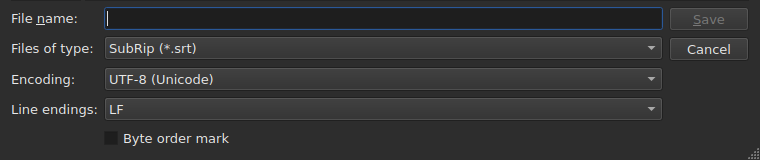

# Ouvrir et enregistrer

Le menu **File** porte les trois commandes.

| Commande | Raccourci | Ce qu'elle fait |
| :------- | :-------- | :-------------- |
| `Open…` | `Ctrl+O` | choisit un fichier et l'ouvre à la place du courant |
| `Save` | `Ctrl+S` | réécrit le fichier ouvert |
| `Save As…` | `Ctrl+Maj+S` | choisit un chemin et un format, puis écrit |

`Open…` et `Save` sont aussi dans la barre d'outils.

## Ouvrir

Le dialogue filtre les deux formats lus, **SubRip** (`.srt`) et **WebVTT**
(`.vtt`), et propose de tout afficher. Le format est ensuite reconnu au contenu,
pas à l'extension : un `.txt` qui contient du SubRip s'ouvre.

**Un fichier illisible ne remplace rien.** Absent, refusé par le système, écrit
dans un encodage sous lequel ses octets ne se décodent pas, ou d'aucun format
connu : une modale **nomme la cause**, et la fenêtre garde ce qu'elle avait,
sous-titres, historique et modifications comprises.

| Message | Ce qui s'est passé |
| :------ | :----------------- |
| `does not exist` | le chemin ne désigne aucun fichier |
| `cannot be opened: permission denied` | le système refuse de l'ouvrir |
| `cannot be read` | le système a refusé pour une autre raison |
| `cannot be decoded in the chosen encoding` | les octets ne se lisent pas dans l'encodage retenu |
| `is in no format this tool knows` | aucun format ne reconnaît le contenu |
| `holds nothing recognisable as a subtitle` | le format est reconnu, mais rien n'y est un sous-titre |

Le message est précédé du chemin : `notes.txt: is in no format this tool knows`.
Ce sont les mots de la ligne de commande, et ce n'est pas un hasard — les deux
surfaces lisent un fichier par la même recette.

Ouvrir depuis la ligne de commande fonctionne toujours : `subedit-gui film.srt`.
Là, la même raison est écrite sur la sortie d'erreur, et la fenêtre s'ouvre
vide — voir [Invocation](invocation.md#quand-louverture-échoue).

## Les diagnostics d'une lecture

Un fichier réel est rarement parfait, et la lecture s'en remet plutôt que
d'abandonner : un numéro absent, une ligne qui ne va nulle part, des fins de
ligne mélangées. **Ce qu'elle a rencontré s'affiche sous la table**, dans un
panneau replié qui s'ouvre d'un clic.

```
line 5: a SubRip block without its number, settled by the reader
```

Chaque ligne porte **le numéro de ligne du fichier** — celui qu'un éditeur de
texte montrerait —, ce qui a été rencontré, et ce qui en a été fait. Un extrait
du fichier suit entre guillemets quand il apporte quelque chose ; il est tronqué
au-delà de quatre-vingts caractères.

**Une seule ligne n'a pas de numéro**, celle de l'encodage : il a été proposé en
pesant les octets, avant qu'une seule ligne du fichier existe.

```
an encoding nothing declared ("windows-1252"), settled by the reader
```

Elle ne s'affiche que lorsque l'encodage a été **deviné et n'est pas de
l'UTF-8** — un fichier UTF-8 lu comme tel n'est pas un événement, et le dire à
chaque ouverture mettrait un panneau sous la table de tous les documents
ordinaires. Un fichier qui porte une marque d'ordre des octets ne la déclenche
pas non plus : il a déclaré son encodage, rien n'a été deviné.

Le panneau **n'apparaît pas** quand la lecture n'a rien à signaler.

## Enregistrer

`Save` réécrit le fichier ouvert **dans sa forme d'origine** : son format, son
encodage, ses fins de ligne, sa marque d'ordre des octets et son en-tête. Un
fichier ouvert puis enregistré sans modification ne bouge pas d'un octet — voir
la garantie exacte plus bas.

L'écriture est **atomique** : elle passe par un fichier temporaire renommé
par-dessus. Une sauvegarde interrompue à n'importe quel moment laisse la version
précédente intacte.

Enregistrer un document qui n'a jamais été sur disque revient à `Save As…`.

**Une écriture qui échoue le dit et ne perd rien** : le disque plein, un fichier
en lecture seule, un répertoire absent — ou **un caractère que l'encodage du
fichier ne sait pas écrire**, un `ł` dans un fichier en Latin-1. Le message est
alors `holds a character the chosen encoding cannot write`, et rien n'est
écrit : remplacer le caractère par un `?` perdrait du texte sous les yeux de qui
vient de le taper. Le message nomme le fichier et la raison, la fenêtre garde
ses modifications, et la marque du titre reste.

## Enregistrer sous

`Save As…` demande un chemin, un format, **et la forme des octets écrits** :
l'encodage, les fins de ligne, la marque d'ordre des octets. Le document **vit
ensuite là** : le titre change, `Save` vise le nouveau fichier et écrit dans la
forme choisie, et le fichier d'origine reste tel qu'il était.




**Les images ne montrent que le bas de la boîte**, et pas la liste des fichiers
au-dessus : celle-ci dépend de la machine — ses répertoires, ses dates, ses
raccourcis latéraux —, donc sa photographie ne serait jamais deux fois la même.
Ce bandeau-ci l'est, et c'est là que tout se joue.

| Champ | Ce qu'il propose | Défaut |
| :---- | :--------------- | :----- |
| `Encoding` | quatorze encodages qu'un fichier de sous-titres porte en pratique, plus `Other…` | **celui du fichier lu** |
| `Other…` | un champ où taper tout encodage qu'ICU sait écrire — `cp1257`, `EUC-KR` | — |
| `Line endings` | `LF`, `CRLF` ou `CR` | celles du fichier lu |
| `Byte order mark` | la marque, **éteinte pour un encodage qui n'en porte pas** | celle du fichier lu |

**Les défauts sont ceux du fichier lu, et c'est une garantie plutôt qu'une
commodité** : un fichier ouvert puis réenregistré sans qu'on touche à ces trois
champs rend les mêmes octets.

**La liste est courte, et ce n'est pas un plafond.** ICU en connaît
quatre-vingt-dix-sept et plus ; ce que le menu propose est ce qu'un fichier de
sous-titres porte en pratique, parce qu'un menu de quatre-vingt-dix-sept entrées
n'aide personne. `Other…` ouvre le reste.

**Un nom que personne ne connaît n'écrit rien.** Taper `klingon-1` ne fait pas
retomber sur l'UTF-8 : rien n'est écrit, et le message le dit.

**Un nom qui ne dit pas son ordre d'octets non plus.** `UTF-16` et `UTF-32` sont
des noms qu'ICU connaît, dont le convertisseur écrit **sa propre marque** : la
case `Byte order mark` cesserait alors de décider quoi que ce soit. Les deux
sont refusés, et le message envoie vers `UTF-16LE` ou `UTF-16BE`, qui écrivent
les mêmes octets sous le contrôle de la case. C'est le même refus, dans les
mêmes mots, que celui de la ligne de commande.

**Un caractère que l'encodage choisi ne sait pas écrire arrête l'enregistrement**
— un `ł` dans du Latin-1. Le message est
`holds a character the chosen encoding cannot write`, la fenêtre garde ses
modifications, et le fichier visé n'est pas touché.

**Le document ne déménage pas non plus** : il reste sur son fichier, dans son
format et son encodage, et le `Save` suivant réécrit celui qu'on avait ouvert.
Un enregistrement qui n'a pas eu lieu ne change rien du tout — ni sur le disque,
ni dans la fenêtre.

Changer de format change ce que la table montre — le séparateur décimal suit le
format, virgule pour SubRip, point pour WebVTT.

**Ce qui appartient à l'autre format est laissé de côté.** Un fichier WebVTT
porte des identifiants de cue et des réglages de placement ; SubRip porte des
coordonnées d'affichage. Écrire dans l'autre format les ignore silencieusement
plutôt que de les traduire au hasard — ils ne sont pas perdus pour autant, ils
ne sont simplement pas écrits.

## La garantie d'aller-retour

Elle a deux moitiés, et il faut les deux :

- **fidèle octet pour octet** sur un fichier déjà dans la disposition que
  `subedit` écrit — celle de Gaupol, ligne vide finale comprise —, et **quel
  que soit son encodage** : un fichier en CP1252 ou en UTF-16 est réécrit dans
  le sien, marque comprise ;
- **idempotent** sinon : le premier enregistrement normalise la disposition,
  aucun ensuite ne touche plus rien.

Concrètement, un fichier dont le dernier bloc n'est pas suivi d'une ligne vide en
gagne une, une fois. C'est le seul changement qu'une sauvegarde sans
modification peut produire.

## Les modifications non enregistrées

Fermer la fenêtre ou ouvrir un autre fichier alors que le document diffère de
celui du disque **demande confirmation**, avec trois issues :

| Réponse | Ce qui se passe |
| :------ | :-------------- |
| `Save` | le document est écrit, puis la fenêtre se ferme ou ouvre l'autre fichier |
| `Discard` | les modifications sont perdues, et l'action se poursuit |
| `Cancel` | rien ne se passe ; la fenêtre reste comme elle était |

Fermer la boîte sans répondre vaut `Cancel`.

**Si l'enregistrement échoue**, l'action ne se poursuit pas : le travail n'est ni
écrit ni perdu.
