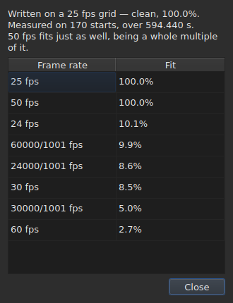

# La grille d'images

Un fichier de sous-titres **ne déclare pas** la fréquence d'image contre
laquelle ses positions ont été calculées : SubRip n'a pas d'en-tête, celui de
WebVTT est du texte libre. La fenêtre la **déduit** des positions elles-mêmes,
dès l'ouverture, et la montre à deux endroits qui ne répondent pas à la même
question.

| Surface | Ce qu'elle donne |
| :------ | :--------------- |
| la barre d'état | **la réponse**, en permanence et sans qu'on la demande |
| `Tools ▸ Frame Rate Analysis…` | **le raisonnement**, quand on veut le voir |

## Ce que la barre d'état montre

À droite, entre ce qu'elle dit de
l'[encodage](fichiers.md#lencodage-dans-la-barre-détat) du fichier lu et ce
qu'elle dit de la [vidéo associée](video.md#ce-que-la-barre-détat-montre) :

| Situation | Ce qui est écrit |
| :-------- | :--------------- |
| les positions sont sur une grille | `Grid: 24 fps` |
| une partie d'entre elles seulement | `Grid: 29.97 fps (partial)` |
| aucune grille connue ne convient | `No grid` |

**`No grid` ne nomme aucune fréquence, et c'est voulu.** L'ensemble des
candidates est clos — les huit que le dialogue de conversion propose — et
rapporter la moins fausse d'entre elles serait donner une mauvaise réponse là où
« je ne sais pas » est la bonne.

**`No grid` a deux causes, et ce ne sont pas la même réponse.** Ou bien aucune
grille ne convient, ou bien le fichier compte trop peu de sous-titres pour qu'on
puisse en dire quoi que ce soit — deux débuts paraissent toujours parfaitement
alignés, et ça ne prouve rien. La barre d'état dit la même chose des deux ;
**l'analyse les distingue**, et donne dans le premier cas de combien la
meilleure candidate échoue.

La ligne **se remet à jour après chaque opération**. Aligner un fichier sur une
autre cadence change la grille, et la barre d'état ne doit pas continuer à
annoncer l'ancienne.

### Un document compté en images n'a pas de grille, il a une fréquence

**MicroDVD est le seul des neuf à compter en images.** Chacune de ses lignes
porte deux numéros d'image et rien d'autre, et le fichier **ne dit pas** à
quelle fréquence les lire. La même place de la barre d'état écrit alors :

| Situation | Ce qui est écrit |
| :-------- | :--------------- |
| le document est compté en images | `Frames: 24000/1001 fps` |

**Ce n'est pas la grille, et la grille serait circulaire ici.** Les positions
d'un document MicroDVD ont été calculées *à partir* de ses images à cette
fréquence-là ; en déduire une grille rendrait ce nombre, c'est-à-dire une donnée
habillée en mesure.

**D'où elle vient est dit une fois**, par la lecture, dans le
[liste des diagnostics](fichiers.md#les-diagnostics-dune-lecture) :
`counts in frames and states no rate; it was read at ("24000/1001")`. La ligne
de la barre d'état, elle, dit ce qui est, en permanence.

**Se tromper de fréquence déplace tout le fichier**, et le dialogue
[`Convert Frame Rate…`](operations.md#convert-frame-rate) est où on le corrige :
il s'ouvre sur la fréquence de lecture et dit que c'est elle.

## Ce que l'analyse montre

`Tools ▸ Frame Rate Analysis…` **ne modifie rien.** Elle ouvre sur un résumé et
le classement des huit candidates avec leur score.




Le résumé dit la réponse, puis ce qui la nuance — chaque phrase n'apparaissant
que si elle a quelque chose à dire :

| Ce qui peut s'y lire | Quand |
| :------------------- | :---- |
| sur combien de débuts, et sur quelle étendue | toujours |
| de combien le fichier est décalé de sa grille | ses positions y sont à une constante près |
| qu'une autre cadence convient tout aussi bien | elle est un multiple entier de celle retenue |
| que l'étendue ne permet pas de départager deux cadences | le fichier est trop court pour les séparer |
| combien de débuts quittent la grille, **et en combien de suites** | le fichier est partiel |

**Le nombre de suites est ce qui distingue deux histoires** que le seul
pourcentage confond. Beaucoup de suites d'un seul début, ce sont des positions
corrigées à la main, une par une. Quelques longues suites, c'est une section
recalée, ou un fichier assemblé à partir de deux autres.

**Le classement complet est montré plutôt qu'une seule réponse.** Un fichier qui
convient à 25 à cent pour cent et à 50 à cent pour cent dit quelque chose qu'un
verdict seul cacherait.

## Quand la conversion était fausse

Un fichier qui ne tombe sur aucune grille est parfois un fichier qu'on a **converti à la mauvaise
fréquence** : il est alors sur une grille bien réelle, mais décalée d'un rapport qui n'est celui
d'aucune des huit. Quand la déduction rend `none` ou `partial`, l'analyse cherche **parmi les
cinquante-six paires ordonnées des huit fréquences normalisées** — c'est l'ensemble, fermé — celle
dont la conversion remet les positions sur une grille. Chaque rapport est appliqué aux positions, et
**c'est la déduction elle-même qui juge le résultat** : la confiance est ce qu'elle dirait, jamais un
nombre inventé. Deux paires qui font le même rapport, comme 30 vers 25 et 60 vers 50, sont une seule
conversion.

La phrase s'ajoute au résumé :

```text
converting from 24 to 25 fps puts the positions on a 24 fps grid: 99.9%, against 11.8% as they are and 14.9% for the next best conversion
```

Elle donne la conversion, la grille où les positions tomberaient et à quel point elles y tombent,
**puis l'écart avec les positions telles qu'elles sont et avec la meilleure des autres
conversions.** Un bouton `Convert Frame Rate…` ferme l'analyse et ouvre [le dialogue de
conversion](operations.md#convert-frame-rate) **rempli avec la paire trouvée** — rien n'est appliqué
tant que le dialogue n'est pas accepté, et l'annulation suffit à revenir. La vidéo, ouverte à côté,
permet de juger à l'image si la réponse est la bonne.

**Quand deux paires se valent, aucune n'est proposée, et la phrase le dit :**

```text
converting from 30 to 25 fps and converting from 25 to 24 fps fit equally well (99.7% and 99.6%), so none is proposed
```

C'est le cas ordinaire plutôt que l'exception : une grille à 28,8 images par seconde se remet aussi
bien sur 24 que sur 30, et un fichier dont tous les temps sont doublés reste sur la grille de 25.
Le geste qui a une seule réparation est de convertir un fichier **déjà** à la fréquence visée. Pour
une égalité, la vidéo tranche : on ouvre `Convert Frame Rate…` soi-même sur l'une des deux paires.

**Rien n'est dit** d'un fichier déjà sur une grille, d'un fichier trop court pour qu'un verdict
vaille, ni d'un fichier qu'aucune conversion de l'ensemble ne remet sur une grille — une dérive, un
rapport hors des huit fréquences, des positions sans structure.

## Ce que la table ne montre pas

**Aucune ligne de la table n'est marquée à cause de la grille**, jamais.

Dès qu'on corrige une position à la main, elle cesse d'être alignée. Un
marquage automatique signalerait donc le travail de l'utilisateur comme une
anomalie, sur un fichier qu'il est justement en train de corriger. La déduction
parle du **document**, et l'analyse est la seule exception — parce qu'on l'a
ouverte pour ça.

Les marques de la table, elles, portent sur ce qui ne tient pas debout : une fin
avant son début, un chevauchement, un ordre rompu. Voir [La table](table.md).
