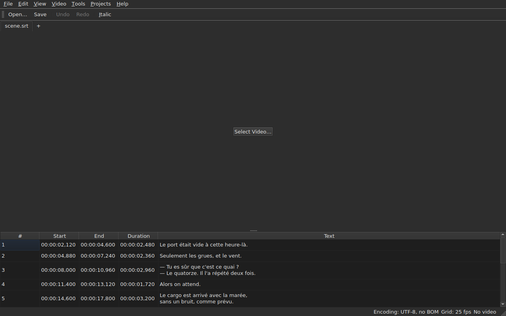

# subedit-gui — manuel

La fenêtre de subedit : ouvrir un fichier de sous-titres et le voir dans une
table. Pour l'autre programme et pour savoir par où commencer, voir
[le manuel](../index.md).

> **État actuel.** La fenêtre **ouvre**, **affiche**, **édite ses cellules**,
> **insère et supprime des lignes**, **annule**, **enregistre**, et **marque les
> sous-titres dont les positions ne tiennent pas debout**. Le menu `Tools` porte
> six opérations — décaler, transformer, convertir la fréquence d'image, retirer
> les mentions pour malentendants, aligner sur une cadence, ramener sur la
> grille — et l'analyse de grille, qui ne modifie rien. Elle **associe une vidéo
> au document**, choisie ou devinée, et la **joue dans la fenêtre**, la réplique
> courante dessinée sur l'image ; du pilotage, elle ne donne que jouer et
> arrêter. Elle **retient sa géométrie, ses colonnes et ses réglages** d'une
> session à l'autre, et se porte **claire ou sombre** au choix. `Help ▸ Manual`
> ouvre **ce manuel** dans une fenêtre. Ce manuel décrit ce qui existe, jamais
> ce qui est prévu ; ce qui vient ensuite est dans la
> [feuille de route](../../feuille-de-route.md).

> **Les images de ce manuel sont engendrées, la prose non.** Les exemples de
> `subedit-cli` sont engendrés en exécutant la commande ; les captures d'écran
> le sont en construisant la vraie fenêtre et en la photographiant — `make
> manual` fait les deux. Une image ne peut donc pas décrire une interface qui
> n'existe plus, et une interface qui change se voit dans le diff du dépôt. Ce
> qui reste sans filet est le texte autour, dont la justesse repose sur la
> relecture.

**Chaque écran est montré deux fois, sous les deux palettes que l'application
pose** — `Light` et `Dark`, celles que
[les préférences](preferences.md#le-thème) proposent. Sous un bureau dont le
thème gouverne, `System` donne l'une ou l'autre selon ce que le bureau a choisi.

## Les menus

`File`, `Edit`, `Video`, `Tools`, `Help` — dans l'ordre où l'on s'en sert : le
document, ce qu'on lui fait, ce qui l'accompagne, ce qui l'examine, ce qui
l'explique.

`Edit` porte l'annulation, puis, sous un séparateur, l'insertion et la
suppression de lignes, puis, sous un autre, `Preferences…` — défaire est ce qu'on
fait *à* une édition, insérer et supprimer *sont* des éditions, et régler le
thème n'est pas une édition du tout.

`Help` porte deux entrées, dans l'ordre où le menu les montre. `Manual`, ou
`F1`, ouvre ce manuel dans une fenêtre — voir
[Le manuel dans la fenêtre](aide.md). `About subedit` dit la version et la
licence.

## Sections

| Section | Contenu |
| :------ | :------ |
| [Installation](../subedit-cli/installation.md) | construire et installer — la page vaut pour les deux programmes |
| [Invocation](invocation.md) | lancer la fenêtre, arguments, codes de retour |
| [Ouvrir et enregistrer](fichiers.md) | les trois commandes, les diagnostics, l'aller-retour |
| [La table](table.md) | ce que chaque colonne montre |
| [Éditer une cellule](edition.md) | quelles cellules s'éditent, et comment |
| [Insérer et supprimer des lignes](lignes.md) | les deux entrées, leurs raccourcis, où vont les lignes neuves |
| [Annuler et rétablir](annulation.md) | l'historique, les deux actions, la marque de modification |
| [La grille d'images](grille.md) | la cadence déduite des positions, et l'analyse |
| [Les opérations](operations.md) | décaler, transformer, convertir, retirer les mentions, et ce qui dépasse la fin du film |
| [La vidéo associée](video.md) | choisir une vidéo, la proposition automatique, la barre d'état, `ffmpeg` |
| [Le lecteur](lecteur.md) | la vue vidéo, jouer, la ligne qui suit, la réplique dessinée |
| [Les préférences](preferences.md) | le thème, le fichier de préférences, ses options, et ce qu'il advient d'une valeur illisible |
| [Le manuel dans la fenêtre](aide.md) | `Help ▸ Manual`, ce qu'il ouvre et comment y naviguer |
