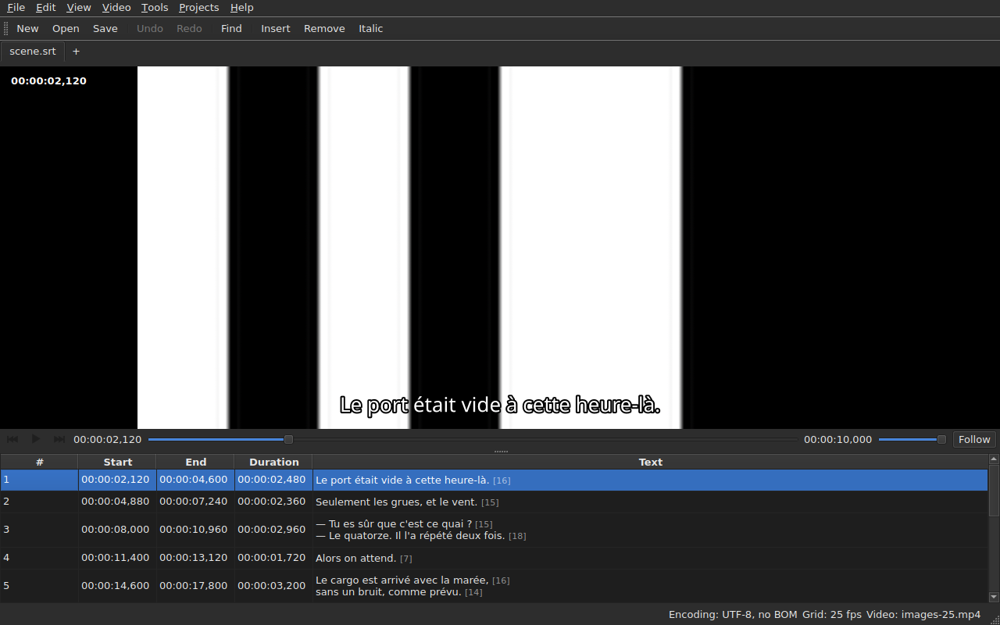

# Le lecteur

La vidéo associée se regarde **dans la fenêtre**, avec la réplique courante
dessinée par-dessus. C'est ce qui permet de vérifier sur le film le résultat
d'un décalage, d'une transformation ou d'une conversion de fréquence.

Voir [La vidéo associée](video.md) pour la façon d'associer un film ; cette
page décrit ce qui se passe une fois qu'il l'est.

## La vue vidéo

| Situation | Ce que montre la fenêtre |
| :-------- | :----------------------- |
| une vidéo est associée et s'ouvre | l'image occupe le haut, la table dessous |
| aucune vidéo associée | pas d'image, la table occupe toute la fenêtre |
| la vidéo ne s'ouvre pas | pas d'image, un message, et la fenêtre reste utilisable |

La séparation entre l'image et la table **se déplace à la souris**. L'image ne
descend pas sous 180 pixels de haut. Agrandir la fenêtre donne la place gagnée
à la table, pas à l'image : ce dont on manque en éditant, ce sont des lignes.

Sous l'image, **une barre de lecture** : où en est le film, combien il dure,
lecture et pause, et le volume. Voir [La barre de lecture](#la-barre-de-lecture).

## Jouer et arrêter

| Commande | Raccourci | Ce qu'elle fait |
| :------- | :-------- | :-------------- |
| `Video ▸ Play / Pause` | `Ctrl+P` | joue si la lecture est arrêtée, l'arrête sinon |

La commande est **inactive tant qu'aucune vidéo n'est ouverte**. Une vidéo qui
vient d'être associée est ouverte **arrêtée** : ouvrir un film n'est pas le
regarder.

`Ctrl+P` là où Gaupol a un simple `P` : un raccourci d'une seule lettre à
l'échelle de la fenêtre est pris avant que le widget qui a le focus le voie,
donc un `P` serait avalé sur le chemin d'un éditeur de cellule. Rien ne
s'imprime ici, la combinaison est libre.

## La barre de lecture

Sous l'image, de gauche à droite — les trois boutons sont des **icônes**, celles du thème du bureau quand il en a, celles du style de Qt sinon :

| Élément | Ce qu'il fait |
| :------ | :------------ |
| les deux boutons de pas | reculent, avancent le film **d'un pas d'image** — voir [Image par image](calage.md#image-par-image) |
| lecture / pause | joue ou arrête, comme `Ctrl+P` — le bouton montre **ce qu'il fera** : un triangle à l'arrêt, deux barres en lecture ; l'infobulle le dit en toutes lettres |
| la position | `HH:MM:SS,mmm`, écrite comme la table écrit une position |
| le curseur | **se lit et se déplace** : on tire la poignée, on clique dans la rainure, on utilise les flèches |
| la durée | celle que la vidéo déclare |
| le volume | de 0 à 100, voir [Le volume](#le-volume) |
| `Follow` | coché tant que la table suit la lecture, et la remet sur la ligne qui joue quand on le coche — voir [La table suit la lecture](#la-table-suit-la-lecture) |

**Le curseur ne rend pas la main à chaque pixel.** Tirer la poignée demande des dizaines de
positions par seconde, et chacune coûte une image décodée : la première position part tout de
suite, les suivantes attendent un vingtième de seconde, et **la dernière position demandée est
toujours celle qu'on atteint** — au plus tard quand on lâche la poignée. L'image ne reste donc
pas derrière la main, et ne se met pas à dessiner un chemin que personne ne regarde.

**Le curseur avance de lui-même pendant la lecture**, et cela ne compte pas pour un geste :
seul ce qu'on fait déplace le film. Pendant qu'on tient la poignée, la lecture ne la reprend pas.

## Le timecode

**La position est écrite sur l'image**, en haut à gauche, sur un fond translucide qui la rend
lisible sur n'importe quelle scène. Elle est dessinée par la fenêtre, dans sa police, et ne
demande rien au lecteur que la position qu'il donne déjà ; elle se met à jour avec chaque geste,
sans attendre le tour suivant du suivi.

## Se déplacer dans le film

Au menu **Video**, **les gestes de Gaupol**, sous ses noms. Tous sont **éteints sans vidéo**, comme
la lecture ; les trois qui agissent sur la sélection le sont aussi tant que rien n'est sélectionné.

| Commande | Raccourci | Ce qu'elle fait |
| :------- | :-------- | :-------------- |
| `Video ▸ Play Selection` | `Ctrl+Shift+P` | joue de **un peu avant le début** de la sélection **jusqu'à la fin de son dernier sous-titre**, et s'arrête sur l'image |
| `Video ▸ Seek Previous` | `Ctrl+Left` | place la lecture au début du dernier sous-titre **terminé** avant la position |
| `Video ▸ Seek Next` | `Ctrl+Right` | place la lecture au début du premier sous-titre qui **commence** après la position |
| `Video ▸ Seek Backward` | `Ctrl+Shift+Left` | recule d'un saut — trente secondes par défaut |
| `Video ▸ Seek Forward` | `Ctrl+Shift+Right` | avance d'un saut |
| `Video ▸ Seek Selection Start` | `Ctrl+Up` | place la lecture au début de la sélection, **l'avance avant lui** |
| `Video ▸ Seek Selection End` | `Ctrl+Down` | place la lecture à la fin de la sélection, **l'avance avant elle** |

**Les raccourcis sont ceux de Gaupol**, sauf un : `Play Selection` est `O` chez lui, et une
lettre seule est prise par la fenêtre avant que la cellule en cours d'édition la voie — taper un
`o` dans un texte lancerait le film. `Ctrl+P` est la réponse de la lecture, `Ctrl+Shift+P` celle de
la sélection. Les flèches du clavier restent à l'éditeur de cellule quand il est
ouvert : `Ctrl+Left` y déplace le curseur d'un mot, et non la lecture.

- **Le saut** est de 30 secondes, et se règle de 1 seconde à une heure — voir
  [Les préférences](preferences.md#le-lecteur). Il ne dépasse ni le début du film ni sa fin.
- **L'avance** est d'une seconde : on regarde un peu **avant** le sous-titre, pour le voir arriver.
  Elle se règle de 0 à 60 secondes, et la lecture ne descend pas sous zéro.
- **Un voisin qui n'existe pas** — rien avant le premier sous-titre, rien après le dernier — ne fait
  rien, et ne dit rien : la lecture reste où elle est.
- **Chaque geste se montre tout de suite** : la barre, le timecode et la réplique dessinée sont à
  jour quand il se termine, sans attendre le tour suivant.

## Le volume

Le volume est celui du **lecteur**, de 0 à 100, et non celui du système. Il se règle au curseur de
la barre, ou par deux gestes, au sous-menu `Video ▸ Audio`, de cinq en cinq :

| Commande | Raccourci | Ce qu'elle fait |
| :------- | :-------- | :-------------- |
| `Video ▸ Audio ▸ Volume Down` | `Ctrl+-` | baisse le volume de cinq |
| `Video ▸ Audio ▸ Volume Up` | `Ctrl++` ou `Ctrl+=` | le monte de cinq — le second pour les claviers où le plus demande la touche majuscule |

**Il est retenu d'une session à l'autre**, et donné à chaque vidéo qu'on ouvre. Une valeur hors de
0 à 100 dans le fichier de réglages ne casse pas l'ouverture : elle est ignorée, et la fenêtre le dit.
**La piste audio, elle, n'est pas retenue** — un numéro de piste est celui de son fichier ; voir
[La piste audio](video.md#la-piste-audio).

## Sélection et lecture

Les deux vont dans les deux sens.

| Ce qu'on fait | Ce qui se passe |
| :------------ | :-------------- |
| sélectionner une ligne | la lecture se place **au début de ce sous-titre** |
| étendre la sélection vers le bas | rien de plus : c'est la première ligne de la sélection qui compte |
| la lecture avance | la **ligne courante** suit le sous-titre à l'écran, **teintée**, et la table la **centre** — voir [La table suit la lecture](#la-table-suit-la-lecture) |

La ligne courante et la sélection sont deux choses distinctes. La lecture
déplace la première et **ne touche jamais la seconde** : la sélection est ce à
quoi une opération s'applique, et un film qui joue dans un coin n'a pas à
réécrire la cible de l'utilisateur ligne après ligne.

La teinte suit cette même règle : c'est un repère, pas une sélection. **Une
anomalie l'emporte sur elle** — une ligne qui porte les deux garde la couleur de
son défaut, un défaut étant là pour être réparé quand une ligne montrée l'est le
temps d'une réplique. Voir [La table](table.md).

### La table suit la lecture

**La table centre la ligne qui joue** — au milieu de ce qu'elle montre, et non au bord où il suffirait de
la rendre visible. Elle le fait **quand la ligne change**, non à chaque tick du suivi : une réplique dure
des secondes, et un recentrage toutes les dixièmes de seconde serait un défilement sans objet.

**Un défilement à la main suspend le suivi.** La molette, la barre de défilement et un clic dans la table
le suspendent : la table reste où on l'a mise, pendant que la ligne courante, la réplique et la barre
continuent de suivre le film. Le bouton **`Follow`**, à droite de la barre de lecture, **est coché tant que
la table suit** et se décoche alors.

**Le suivi reprend sur un geste du lecteur** : la lecture lancée, un saut, un pas, un repère posé, une
insertion à la position, ou un déplacement de la barre — la table se centre alors tout de suite sur la
ligne qui joue, même si c'était déjà la même. **Ou à la demande** : cocher `Follow` le rétablit, et le
décocher le suspend. Il n'y a pas de minuterie : ce qui reprend le suivi est toujours un geste.

Passer à un autre onglet reprend le suivi sur le film de cet onglet.

**Une édition en cours n'est pas interrompue.** Tant qu'un éditeur de cellule
est ouvert, la ligne courante reste où elle est ; la réplique dessinée sur
l'image, elle, continue de suivre, puisqu'elle ne dérange personne.

## La réplique dessinée

Ce qui s'affiche sur l'image vient du **document ouvert**, jamais d'un fichier :
**ce qu'on voit sur l'image est ce qu'on vient de taper**, sans passage par le
disque. Le texte apparaît centré, au bas de l'image, et disparaît entre deux
sous-titres.

**Avec une traduction, la réplique est celle du texte visé** : la traduction quand
la cellule courante est dans la colonne `Translation`, le texte principal
partout ailleurs. C'est la règle de toutes les opérations de texte — voir [Le
texte que les opérations visent](table.md#le-texte-que-les-opérations-visent) —
et **il n'y a pas de réglage** : passer d'une colonne à l'autre change ce que
l'image montre, au plus une dixième de seconde plus tard. Sans traduction, ou
avec la colonne retirée, rien ne change : c'est le texte principal.

Un sous-titre que la traduction n'a pas encore rejoint ne montre **rien** tant
que la colonne courante est la traduction : ce n'est pas le texte principal qui
prend sa place.

**Les balises du format sont comprises, jamais dessinées telles quelles.** Le modèle porte le
texte comme le fichier l'écrit, et c'est le pivot de balises — celui de la conversion de
format — qui le lit avant de le donner à l'image :

| Dans le fichier | Sur l'image |
| :-------------- | :---------- |
| gras, italique, souligné | appliqués : `<i>non</i>` s'affiche *non*, sans ses balises |
| couleur | appliquée |
| police, taille | retirées, le texte reste |
| position, alignement, locuteur, tout ce qui n'a pas d'équivalent à l'écran | retirés, le texte reste |
| `{` et `}` dans le texte | dessinés : « {rires} » s'affiche « {rires} » |

Un fichier Advanced SSA est lu de la même façon : ses `{\i1}` s'appliquent, et son
`{\an8}` est retiré — la réplique reste au bas de l'image. Chaque texte est lu **dans le format
de son propre fichier**, la traduction comme le texte principal.

**Le fichier de sous-titres voisin n'est pas chargé** par le lecteur, même s'il porte le nom du
film. Il serait celui qu'on est en train d'éditer, et l'image montrerait alors l'état du disque
pendant que la table montre autre chose.

## Prévisualiser un changement

Il n'y a **rien de particulier à faire** : on applique l'opération, on regarde
le film, et on choisit `Undo: shifting` — ou l'opération concernée — si le
résultat ne convient pas. Voir [Annuler et rétablir](annulation.md).

Aucun mode de prévisualisation séparé n'existe, et c'est délibéré : ce qu'on
regarde est le document tel qu'il est, pas un état provisoire invisible.

## Quand l'image n'apparaît pas

Deux messages possibles, tous deux préfixés du chemin du fichier :

| Message | Ce qui s'est passé |
| :------ | :----------------- |
| `<fichier>: <raison>` | le lecteur a refusé le fichier — format inconnu, fichier absent, répertoire |
| `<fichier>: no video player is available` | aucun lecteur n'a pu être construit |

Dans les deux cas, **la vidéo reste associée** — il faut bien voir de quel
fichier il s'agit pour en choisir un autre — et **la fenêtre reste utilisable** :
le document est ouvert, les opérations fonctionnent, l'enregistrement aussi.

**L'image est dessinée dans la fenêtre elle-même** : `libmpv` remplit un tampon à la
taille de la vue, en pixels réels, et la fenêtre le peint. Rien n'en dépend de la
plateforme graphique — la même image sous X11, sous Wayland et sans écran — et elle
suit le redimensionnement : le rapport d'aspect du film est conservé, le reste de la
vue est noir.

Le second message n'apparaît donc que si la bibliothèque `libmpv` refuse de démarrer,
alors qu'elle est requise à la compilation.

Le rendu passe par le processeur : le décodage matériel sans copie n'est pas
disponible. Sur un éditeur de sous-titres, une image coûte quelques millisecondes, et
la lecture tient le temps réel.

## Ce qui n'y est pas

**Le pilotage va jusqu'aux sauts, à la sélection et au volume.** Ce qui n'existe pas, et qu'il est
inutile de chercher :

- avance image par image, poser un repère depuis la position courante ;
- forme d'onde.

Ce manuel décrit ce qui existe : ce qui viendra, et dans quel ordre, est dans la
[feuille de route](../../feuille-de-route.md).
