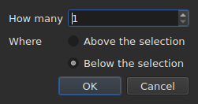

# Insérer, supprimer, fusionner et scinder des lignes

Quatre entrées du menu `Edit`, sous un séparateur qui les sépare de
`Find and Replace…`. Elles ont en commun de changer le nombre de lignes, là où
couper, copier et coller, plus haut, déplacent des textes.

| Entrée | Raccourci | Ce qu'elle fait |
| :----- | :-------- | :-------------- |
| `Insert Subtitles…` | `Ins` | ouvre un dialogue, puis pose des lignes vierges |
| `Remove Subtitles` | `Del` | retire la sélection, sans rien demander |
| `Merge Subtitles` | aucun | fait une seule ligne d'un bloc de lignes voisines |
| `Split Subtitle` | aucun | coupe une ligne en deux au milieu de sa durée |

Les quatre entrent dans l'historique : `Ctrl+Z` les défait comme le reste.

## Insérer

| Champ | Ce qu'il vaut | Défaut |
| :---- | :------------ | :----- |
| `How many` | un entier de 1 à 99 999 | `1` |
| `Where` | `Above the selection` ou `Below the selection` | le dernier choix, `Below` au premier lancement |

`OK` pose les lignes, `Cancel` ne pose rien.

### Où elles vont

**Au dernier sélectionné**, et non au premier. Sélectionner les lignes 1 et 3
puis insérer en dessous pose la nouvelle ligne en position 4 — pas en
position 2. C'est ce que Gaupol fait depuis vingt ans, et c'est ce que la main
attend après avoir balayé du haut vers le bas.

`Above the selection` la pose juste avant cette même ligne.

### Combien de temps elles durent

Une ligne vierge n'a pas de texte, mais elle a des positions. Elles se déduisent
de la place disponible :

| Situation | Début | Durée |
| :-------- | :---- | :---- |
| entre deux sous-titres | la fin de celui d'avant | la place jusqu'au suivant, partagée en parts égales |
| après le dernier | la fin du dernier | trois secondes chacune |
| en tête d'un fichier | l'origine | la place jusqu'au premier, partagée |
| dans un fichier vide | l'origine | trois secondes chacune |

Quand le fichier se chevauche à l'endroit choisi, il n'y a **pas de place à
partager** : les lignes reçoivent une durée nulle, ce que la table montre, plutôt
qu'une durée inventée qui passerait par-dessus la voisine.

### Le document vide

**Aucune sélection n'est exigée**, et c'est la seule façon de commencer un
fichier neuf : les lignes vont à l'index zéro. Le choix du côté est alors éteint
dans le dialogue — il n'y a pas de sélection à situer.

Dès que le document porte une ligne, l'entrée `Insert Subtitles…` **s'éteint tant
que rien n'est sélectionné** : sans sélection, l'index serait deviné.

### Après coup

Les lignes posées sont **sélectionnées**, et la table s'y rend. Appuyer sur
`Ins` une seconde fois insère donc à la suite, sans avoir à cliquer entre les
deux.

### Le côté est retenu

`Above` ou `Below` est retenu **d'une insertion à la suivante, et d'une session à
la suivante** : c'est l'option `edit.insert-placement` du
[fichier de préférences](preferences.md#le-fichier). On n'insère pas une fois,
on insère dix lignes de suite, toujours du même côté.

## Supprimer

`Remove Subtitles`, ou `Del`, retire les lignes sélectionnées — y compris une
sélection discontinue, chaque ligne revenant à sa place si l'on annule.

**Aucune confirmation n'est demandée**, et ce n'est pas une négligence :
l'opération se défait par `Ctrl+Z`. Une modale devant un geste annulable
coûterait un clic à chaque fois pour épargner un `Ctrl+Z` de temps en temps.

**L'entrée est éteinte quand rien n'est sélectionné.** Ailleurs dans la fenêtre,
« rien de sélectionné » veut dire « tout le fichier » — c'est ce qui rend un
décalage utilisable sans sélectionner quatre mille lignes. Ici, cette lecture
viderait un document d'un `Del` malheureux, donc elle n'est pas offerte.

Après le retrait, **la ligne qui a pris la place de la première retirée est
sélectionnée** — ou la dernière restante, si le retrait a emporté la fin du
fichier. Appuyer sur `Del` plusieurs fois de suite retire donc les lignes une
à une.

Un fichier entièrement vidé laisse la fenêtre utilisable : `Insert Subtitles…`
se rallume, puisqu'un document vide s'insère sans sélection.

## Fusionner

`Merge Subtitles` fait **une seule ligne** des lignes sélectionnées :

| Ce que la ligne fusionnée reçoit | D'où il vient |
| :------------------------------- | :------------ |
| son début | le début de la première |
| sa fin | la fin de la dernière |
| son texte | les textes de toutes, dans l'ordre, un saut de ligne entre deux |
| sa traduction | les traductions, recollées de la même façon |
| ce que le format porte en plus — un style, une couche, des coordonnées | la première |

**Un texte vide ne laisse pas de ligne vide** : fusionner `Un.`, une ligne sans
texte et `Trois.` donne deux lignes de texte, pas trois.

Les lignes fusionnées disparaissent, et la ligne qui les remplace prend la place
de la première.

**L'entrée est éteinte** tant que la sélection n'est pas **un bloc d'au moins
deux lignes voisines**. Une ligne seule n'a rien avec quoi fusionner ; les lignes
1 et 3 sans la 2 non plus, puisque le résultat passerait par-dessus la 2 et la
recouvrirait.

Après la fusion, **la ligne fusionnée est sélectionnée** : `Split Subtitle` est
prêt à la couper de nouveau.

## Scinder

`Split Subtitle` coupe la ligne sélectionnée **au milieu de sa durée**, à la
milliseconde près :

| Moitié | Début | Fin | Texte |
| :----- | :---- | :-- | :---- |
| la première | le début d'origine | le milieu | **tout** le texte, et la traduction |
| la seconde | le milieu | la fin d'origine | vide |

**Le texte n'est pas coupé à son saut de ligne.** Ce serait juste pour un
sous-titre de deux lignes et faux pour un sous-titre d'une ligne ou de trois ;
tout le texte reste à la première moitié, et on déplace soi-même ce qui doit
passer à la seconde.

La première moitié garde ce que le format portait en plus du texte ; la seconde
naît comme une ligne insérée, sans rien.

**L'entrée est éteinte** tant que la sélection ne compte pas **exactement une
ligne**. Rien de sélectionné ne veut pas dire « tout le fichier » ici.

Après la scission, **les deux moitiés sont sélectionnées** — c'est ce que Gaupol
fait après toute insertion, et `Merge Subtitles` est alors prêt à défaire le
geste.

### Pourquoi pas les raccourcis de Gaupol

Gaupol fusionne par `M` et scinde par `S`. Une lettre seule serait prise à la
table avant d'arriver dans une cellule en cours d'édition, et `Ctrl+S`
enregistre déjà : les deux entrées se prennent par le menu.

## Ce que l'action d'annulation en dit

**Une entrée d'historique par geste.** Fusionner cinq lignes se défait d'un seul
`Ctrl+Z`, et rend les cinq lignes telles qu'elles étaient — positions, textes et
tout ce que le format portait.

| Opération | Ce que `Undo` lit |
| :-------- | :---------------- |
| une insertion | `Undo: inserting` |
| une suppression | `Undo: removing` |
| une fusion | `Undo: merging` |
| une scission | `Undo: splitting` |

Voir [Annuler et rétablir](annulation.md).

## Les raccourcis pendant qu'une cellule est ouverte

`Ins` et `Del` appartiennent au champ de saisie tant qu'un éditeur de cellule
est ouvert : la touche de suppression y efface un caractère, et non un
sous-titre. Fermer l'éditeur — `Entrée` ou `Échap` — leur rend leur sens.

Ce manuel nomme les touches comme le menu les affiche — voir
[Les menus](index.md#les-menus).
