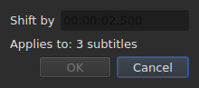
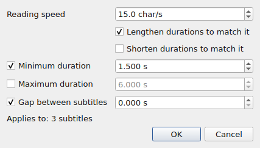
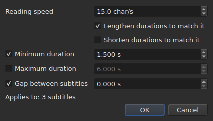

# Les opérations

Le menu **Tools** porte treize opérations et une analyse. Chacune des treize
s'annule d'un `Ctrl+Z` ; l'analyse ne modifie rien.

| Entrée | Dialogue | Ce qu'elle fait |
| :----- | :------- | :-------------- |
| `Shift Positions…` | oui | décale la cible d'une durée |
| `Transform Positions…` | oui | corrige la cible à partir de deux repères |
| `Convert Frame Rate…` | oui | re-cale la cible d'une cadence vers une autre |
| `Adjust Durations…` | oui | déplace les fins pour tenir une vitesse de lecture, des durées et un écart |
| `Italic` | **non** | met la cible en italique, ou l'en retire |
| `Dialogue` | **non** | pose un tiret de dialogue en tête de chaque ligne, ou le retire |
| `Case ▸ Title Case` | **non** | chaque mot prend une capitale |
| `Case ▸ Sentence case` | **non** | la première lettre du texte, et elle seule |
| `Case ▸ UPPER CASE` | **non** | tout en capitales |
| `Case ▸ lower case` | **non** | tout en minuscules |
| `Remove Hearing-Impaired Mentions…` | oui, sans réglage | retire les mentions pour malentendants |
| `Snap to Frame Rate…` | oui | repose chaque horodatage sur l'image la plus proche |
| `Shift Whole File onto Grid (…)` | **non** | ramène tout le fichier sur sa grille |
| `Frame Rate Analysis…` | oui, sans réglage | **ne modifie rien** — voir [La grille d'images](grille.md) |

**Ce qu'une opération a fait se dit dans une boîte d'information qu'il faut
fermer, sauf pour `Italic`, `Case` et `Dialogue`** : ces trois-là n'ouvrent pas
de dialogue, et leur compte rendu — « nothing to change » compris — s'affiche
dans la barre d'état, sans rien à fermer. Les messages sont cités dans la
section de chaque opération.

Insérer, supprimer, fusionner et scinder des lignes ne sont pas ici mais dans le
menu `Edit`, parce qu'elles changent le nombre de lignes. Voir
[Insérer, supprimer, fusionner et scinder des lignes](lignes.md).

## Sur quoi elles portent

**Les lignes sélectionnées, ou tout le fichier si rien ne l'est.** C'est la même
règle pour toutes, et les dialogues, quand il y en a un, le rappellent en toutes
lettres :

```
Applies to: 4 subtitles
```

Sélectionner toutes les lignes revient au même que n'en sélectionner aucune.

**Une exception, et son intitulé la porte** : `Shift Whole File onto Grid`
ignore la sélection. Une grille est une propriété du document, et une moitié de
document n'a pas de grille à elle ; l'entrée le dit donc dans son nom plutôt que
dans ce manuel seul.

**Les deux opérations de grille ne parlent pas de la même chose que la grille.**
Une opération porte sur la sélection ; l'analyse et la barre d'état parlent du
**document entier**. Aligner cinq lignes sur cent soixante-seize change bien ces
cinq-là — la table le montre — sans que ni l'une ni l'autre ne bouge, ce qui se
lit comme un rafraîchissement manqué. C'en n'est pas un : elles n'ont rien à
dire. Voir [`Snap to Frame Rate…`](#snap-to-frame-rate) et
[La grille d'images](grille.md).

### Ce que « rien de sélectionné » veut dire, entrée par entrée

La règle vaut pour le menu `Tools` et pour la recherche. Les entrées du menu
`Edit` qui touchent aux lignes ou les vident la lisent autrement — sans quoi un
`Del` ou un `Ctrl+X` malheureux viderait le document.

| Entrée | Sans sélection | Ce qu'elle exige |
| :----- | :------------- | :--------------- |
| les opérations du menu `Tools` | tout le fichier | un document non vide |
| `Shift Whole File onto Grid` | tout le fichier, **toujours** | une grille trouvée |
| `Find and Replace…` | tout le fichier | un document non vide |
| `Cut Texts`, `Copy Texts`, `Paste Texts` | **éteintes** | au moins une ligne sélectionnée |
| `Remove Subtitles` | **éteinte** | au moins une ligne sélectionnée |
| `Merge Subtitles` | **éteinte** | un bloc d'au moins deux lignes voisines |
| `Split Subtitle` | **éteinte** | exactement une ligne |
| `Insert Subtitles…` | éteinte, sauf sur un document vide | une ligne où se situer |

Chaque page en donne la raison : [le presse-papiers](presse-papiers.md#sur-quoi-elles-portent),
[les lignes](lignes.md), [la recherche](recherche.md#sur-quoi-porte-la-recherche).

Les entrées sont **inactives sur un fichier vide** : il n'y aurait rien à
décaler. `Italic` a une seconde condition, que sa section décrit : le format
ouvert doit savoir écrire un style. La casse et les tirets n'en ont pas — un
texte est un texte dans les neuf formats.

## `Shift Positions…`

Déplace la cible d'une durée, vers l'avant ou vers l'arrière. Les deux bornes de
chaque sous-titre bougent d'autant : aucun ne reste à l'écran plus ou moins
longtemps qu'avant.

La durée s'écrit **comme un horodatage, signe compris** — `00:00:02,500` avance,
`-0:01,250` recule. Les formes acceptées sont celles d'une cellule de position.




| Refus | Pourquoi |
| :---- | :------- |
| une durée illisible | le bouton reste inactif ; rien n'est décalé au hasard |
| un décalage de zéro | il n'y a pas d'opération à enregistrer |
| un sous-titre passerait avant le début de la vidéo | **aucun fichier ne peut porter une telle position** |

Le troisième cas nomme le fautif — « subtitle 1 would start before the origin » —
et c'est celui qu'il faut regarder pour voir de combien on s'est trompé. Rien
n'est appliqué.

## `Transform Positions…`

La correction d'un fichier calé sur un autre montage. On dit où **deux**
sous-titres commencent réellement, et tout le reste suit, proportionnellement.

Le dialogue demande deux fois la même chose : un numéro de sous-titre, et la
position où son début appartient. Le second est pré-rempli sur le dernier
sous-titre du fichier — deux repères éloignés donnent une correction plus sûre
que deux repères voisins.

**Les deux repères atterrissent exactement où on les a demandés.** Ce n'est pas
une approximation : le calcul est fait pour que ce soit vrai.

| Refus | Pourquoi |
| :---- | :------- |
| deux repères sur le même sous-titre | ils ne définissent aucune correction |
| une position illisible | même raison que pour le décalage |

Un numéro hors du fichier ne peut pas être saisi : le champ est borné par le
nombre de sous-titres.

## `Convert Frame Rate…`

Re-cale la cible quand les positions ont été calculées contre une fréquence
d'images et doivent l'être contre une autre.

Les deux listes offrent les huit fréquences normalisées.

> **Se tromper de fréquence d'entrée décale tout le fichier sans rien
> signaler.** C'est le pire mode d'échec de cette opération, et c'est pourquoi
> le dialogue dit d'où viennent les valeurs qu'il propose plutôt que de les
> poser en silence.

### Les deux sources, et ce qu'elles répondent

Le dialogue porte jusqu'à deux lignes de plus, chacune apparaissant quand elle a
quelque chose à dire :

| Ligne | Ce qu'elle dit | Ce qu'elle pré-remplit |
| :---- | :------------- | :--------------------- |
| `The positions say` | la [grille d'images](grille.md) déduite des positions du fichier | `Timed against` |
| `The video declares` | la fréquence que le conteneur annonce, par exemple `24000/1001` | `Should play at` |
| `The file was read at` | la fréquence à laquelle un fichier **compté en images** a été lu | `Timed against` |

**Chaque proposition va au champ auquel elle répond.** La grille dit sur quoi le
fichier a été *écrit* — c'est la liste du haut. Ce que le conteneur annonce est
la cadence à laquelle le film *tourne*, donc celle à laquelle les sous-titres
doivent arriver — c'est la liste du bas.

**Seule une grille nette pré-remplit l'entrée.** Une grille partielle est un
indice que la déduction elle-même qualifie de partiel, et ce champ décide d'une
opération sur le fichier entier. La [barre d'état](grille.md) et l'analyse
portent ce cas-là ; celui-ci non.

**Un fichier compté en images remplace la grille plutôt que de s'y ajouter.**
MicroDVD porte des numéros d'image, et les positions du document en ont été
calculées à la fréquence de lecture : une grille déduite de ces positions-là ne
peut que retrouver ce nombre. `The positions say` disparaît donc, et
`The file was read at` prend sa place — c'est le même choix que fait
[la barre d'état](grille.md#un-document-compté-en-images-na-pas-de-grille-il-a-une-fréquence).

**C'est ainsi qu'on change la fréquence d'un MicroDVD.** Poser la fréquence lue
en entrée et la vraie en sortie recalcule chaque position à partir des images du
fichier — sans relire quoi que ce soit, et l'opération s'annule comme les
autres.

### Un désaccord n'est pas une contradiction

Les deux lignes peuvent s'afficher ensemble et annoncer des nombres différents.
**Ce n'est pas une erreur à arbitrer** : le film tourne à une cadence, le
fichier a été écrit sur une autre grille. Un fichier à 24 pour un film à 25 est
exactement le cas que l'alignement — `snap` en ligne de commande — existe pour
traiter.

Rien n'est donc choisi à la place de l'utilisateur : les deux listes restent
modifiables, et c'est délibéré. Une source qui s'impose interdit de croiser.

Les lignes n'apparaissent pas quand il n'y a rien à dire : aucune vidéo
associée, pas de `ffprobe`, ou aucune grille nette. Le dialogue est alors celui
décrit plus haut, et **aucune opération ne se refuse pour autant** — la
fréquence vient de l'utilisateur. Voir
[La vidéo associée](video.md#ffmpeg-nest-pas-requis).

Une fréquence que le film annonce mais qui n'est pas l'une des huit normalisées
est **affichée sans être choisie** : savoir que le film tourne à une cadence
inhabituelle est l'information, et il n'y a rien à quoi la convertir ici.

Convertir une fréquence en elle-même ne change rien : le bouton reste inactif.

## `Adjust Durations…`

Allonge ou raccourcit la durée des sous-titres de la cible **en déplaçant leur
fin, jamais leur début**. Déplacer le début déplacerait le sous-titre, ce qui est
le travail de [`Shift Positions…`](#shift-positions).





### Les quatre contraintes

| Champ | Ce qu'il demande | Valeurs | Défaut |
| :---- | :--------------- | :------ | :----- |
| `Reading speed` | le temps qu'il faut pour lire le texte | de 1 à 99 caractères par seconde, au dixième | 15 car/s |
| `Lengthen durations to match it` | allonger ce qui est trop court pour être lu | coché ou non | coché |
| `Shorten durations to match it` | raccourcir ce qui reste affiché plus que nécessaire | coché ou non | non coché |
| `Minimum duration` | une durée plancher | de 0 à 99 s, à la milliseconde | coché, 1,5 s |
| `Maximum duration` | une durée plafond | de 0 à 99 s, à la milliseconde | non coché, 6 s |
| `Gap between subtitles` | l'écart à laisser avant le sous-titre suivant | de 0 à 99 s, à la milliseconde | coché, 0 s |

Ce sont les valeurs par défaut de Gaupol.

**Une contrainte décochée est absente** : son champ se grise et n'est pas lu.
Une contrainte cochée à zéro vaut zéro — un écart de 0 s interdit à un
sous-titre de chevaucher le suivant. La vitesse de lecture n'est lue que si
`Lengthen` ou `Shorten` est coché.

**Quand tout est décoché, `OK` est éteint** : il n'y a rien à demander.

Le dialogue rouvre sur les valeurs du dernier ajustement, **et les garde d'une
session à l'autre** — comme les deux options de la recherche. **Une case décochée
garde sa valeur** : décocher `Minimum duration` après avoir posé 2 s ne remet pas
1,5 s, et la recocher retrouve 2 s. Les neuf réglages sont dans le
[fichier de préférences](preferences.md#le-fichier), sous `duration-adjust.`.

### Dans quel ordre, et laquelle gagne

Chaque sous-titre de la cible passe les quatre contraintes **dans cet ordre**, et
chacune pose la fin à son tour :

| Rang | Contrainte | Ce qu'elle pose |
| ---: | :--------- | :-------------- |
| 1 | vitesse de lecture | `fin = début + longueur ÷ vitesse`, si le sous-titre est trop court (`Lengthen`) ou trop long (`Shorten`) |
| 2 | durée minimale | `fin = début + minimum`, si la durée est plus courte |
| 3 | durée maximale | `fin = début + maximum`, si la durée est plus longue |
| 4 | écart | `fin = début du suivant − écart`, si la fin en est trop près — jamais avant le début |

**La dernière appliquée gagne.** L'écart vient en dernier et peut ramener une
durée sous le minimum qu'on venait de poser : deux sous-titres à l'écran en même
temps sont un défaut que le spectateur voit, un sous-titre un peu court ne l'est
pas.

**La longueur du texte se compte hors balises**, en caractères, sauts de ligne
compris : `<i>été</i>` compte trois caractères. La vitesse de lecture parle de
ce que le spectateur lit.

**Le suivant est le sous-titre suivant du fichier**, qu'il soit dans la cible ou
non. **Le dernier sous-titre du fichier n'a pas de suivant** : l'écart ne le
contraint pas.

### Ce qu'aucune fin ne peut satisfaire est dit

Une fois l'ajustement fait, la fenêtre dit combien de fins ont bougé, et **ce
qui n'a pas pu être tenu** — une contrainte n'apparaît que si elle a été
sacrifiée pour au moins un sous-titre :

```text
adjusted the durations of 12 subtitles; could not satisfy the reading speed in 9 subtitles, the minimum duration in 4 subtitles
```

Les trois mentions possibles sont `the reading speed`, `the minimum duration` et
`the gap`. **La durée maximale est toujours tenue** : elle vient après la vitesse
et le minimum, et seul l'écart la suit, qui ne peut que raccourcir. Un minimum
plus grand que le maximum lui cède, et c'est le minimum qui est compté. L'écart
ne se sacrifie que lorsque le suivant commence avant le début du sous-titre
lui-même.

Le compte porte sur toute la cible, **y compris les sous-titres dont la fin n'a
pas bougé** : un sous-titre déjà calé contre son suivant et trop court pour le
minimum est compté. Quand aucune fin ne bouge, la fenêtre le dit —
`no duration to adjust` — et rien n'entre dans l'historique.

## `Snap to Frame Rate…`

Pose **chaque horodatage** — début et fin — sur l'image la plus proche de la
cadence choisie. Une seule liste, et c'est toute la différence avec la
conversion : une conversion a besoin de deux cadences parce qu'elle met le
fichier à l'échelle de l'une vers l'autre ; un alignement n'a besoin que de la
grille sur laquelle atterrir.

| | `Convert Frame Rate…` | `Snap to Frame Rate…` |
| :--- | :-------------------- | :-------------------- |
| déplacement | proportionnel au temps — **plusieurs secondes** sur un long métrage | une demi-image au plus, **partout** |
| pour quel fichier | un fichier dont le **minutage est faux** | un fichier dont le minutage est **juste** et dont la grille est fausse |

**Le cas d'usage**, en toutes lettres : un film à 25 images par seconde, des
sous-titres écrits sur une grille à 24, des répliques déjà à peu près à leur
place à quelques millisecondes près. Il n'y a rien à re-miner — seulement à
reposer les horodatages sur les bonnes images.

La liste **s'ouvre sur ce que la vidéo déclare**, et non sur ce que les
positions disent : l'intention est de rejoindre la grille du film, et la
déduction nomme celle qu'on quitte. Sans vidéo ou sans `ffprobe`, elle s'ouvre
sur la cadence du projet.

Aligner un fichier sur la grille qu'il occupe déjà ne le change pas, et ce n'est
pas une erreur : l'opération s'applique, ne déplace rien, et s'annule comme
n'importe quelle autre.

**Aligner une partie du fichier le dit, une fois fait.** Une notice s'affiche
quand la sélection ne couvre pas tout et que le document reste lu sur une autre
grille :

```
5 of 176 subtitles aligned to 25 fps; the document is still read on a 24 fps grid
```

Elle relie le geste à son effet, et elle explique pourquoi la barre d'état et
l'analyse n'ont pas bougé : elles parlent du document, l'opération portait sur
cinq lignes. Rien n'est empêché — aligner une partie d'un fichier peut se
vouloir.

**C'est presque toujours involontaire, et c'est mesuré.** Sur les huit fichiers
de grille du dépôt, aligner tout le fichier porte la cadence déduite sur la
cible et sa concentration à 100 % ; aligner cinq lignes ne déplace jamais la
cadence déduite et **abaisse** la concentration dans sept cas sur huit — les
lignes alignées ont quitté la grille où le reste du fichier vit. Le huitième est
50 vers 25, où la grille visée divise celle du fichier et où les positions y
étaient déjà.

La notice ne s'affiche pas quand la sélection couvre tout le fichier, quand
aucune grille n'est déduite, ou quand le document se lit désormais sur la
cadence demandée — c'est alors que l'alignement a fait ce qu'on lui demandait.

## `Shift Whole File onto Grid`

Décale **tout le fichier** de la quantité qui remet ses positions sur la grille
qu'elles ont quittée. Un fichier dont les positions sont sur une grille à une
constante près a été décalé, et cette constante se mesure.

**L'entrée de menu porte le montant et la portée** —
`Shift Whole File onto Grid (+0.001 s)`. Il n'y a pas de dialogue :
l'opération ne prend aucune option, et une entrée qui va déplacer un fichier
entier doit dire de combien, et qu'elle le fera en entier, avant d'être choisie.
C'est la seule opération du menu qui ignore la sélection.

**Elle s'éteint quand aucune grille n'a été trouvée.** Il n'y a alors rien à
rejoindre, et une phase mesurée sur du bruit déplacerait le fichier au hasard.
« Rien à rejoindre » et « rejoindre de zéro » ne disent pas la même chose : le
second reste proposé, parce qu'un fichier déjà sur sa grille en est un cas
normal.

**Ce n'est pas `Snap to Frame Rate…`.** Cette entrée-ci décale tout d'une même quantité
et préserve **exactement** le minutage relatif ; l'alignement déplace chaque
position indépendamment et absorbe au passage celles qui avaient été corrigées à
la main. Sur un fichier propre les deux donnent le même résultat ; sur un
fichier partiel, non — et le [détail de l'analyse](grille.md) dit lequel des
deux on a sous les yeux.

## `Italic`

Met la cible en italique en écrivant les balises du **format ouvert**, ou les
retire si elle y est déjà. Pas de dialogue : l'opération n'a pas de réglage, et
elle s'annule d'un `Ctrl+Z` comme les autres.

| Action | Raccourci | Où |
| :----- | :-------- | :--- |
| `Italic` | `Ctrl+I` | menu **Tools**, barre d'outils |

C'est la seule opération du menu qui ait un bouton dans la barre d'outils.

### Ce qu'elle écrit, format par format

Le texte d'un sous-titre est celui de son fichier, balises comprises — voir
[Éditer une cellule](edition.md). Chaque format a les siennes, et c'est ce que
cette entrée dispense de connaître :

| Format | Ce qui est écrit |
| :----- | :--------------- |
| SubRip, WebVTT, SubViewer 2 | `<i>texte</i>` |
| Sub Station Alpha, Advanced SSA | `{\i1}texte{\i0}` |
| MicroDVD | `{Y:i}texte` — la balise court jusqu'à la fin du sous-titre, il n'y a rien à refermer |
| MPL2 | `/` en tête de **chaque** ligne, le marqueur ne portant que sur la sienne |
| TMPlayer, LRC | rien : ces deux formats n'écrivent aucun style |

**L'entrée est éteinte pour un TMPlayer et un LRC, et non cachée.** Une entrée
absente n'apprend rien ; une entrée grise répond à « pourquoi ne puis-je
pas ? ».

### Dans quel sens elle va

Une seule entrée pour les deux sens, et c'est la cible qui décide :

- **un seul sous-titre hors italique suffit** pour que toute la cible y passe ;
- la cible n'en sort que lorsqu'elle y est **entièrement**.

C'est la règle de Gaupol, et c'est la seule qui rende un bouton unique
utilisable : une sélection panachée part d'un bloc plutôt que de s'inverser
ligne par ligne, et appuyer deux fois la rend telle qu'elle était.

Le compte rendu dit ce qui a été fait, dans le sens où cela a été fait :

```
2 subtitles put in italics
2 subtitles taken out of italics
```

**Une ligne vide ne gagne jamais de balises** — un `<i></i>` autour de rien se
verrait dans la table. Une cible qui n'en contient que ne change donc rien, et
le dit : « nothing to change ». Aucune entrée n'entre alors dans l'historique.

### Ce qu'elle ne touche pas

**Les autres balises restent exactement où elles sont** : une couleur, une
police, un `{\pos(x,y)}` d'Advanced SSA traversent l'opération sans bouger.
Seules les balises d'italique sont posées et retirées.

Une balise qui dit plusieurs choses à la fois n'est pas emportée en entier :
`{\b1\i1}` devient `{\b1}`, et `{Y:bi}` devient `{Y:b}`. Le gras reste, et le
texte sort réellement de l'italique.

## `Case` et `Dialogue`

Deux transformations du **texte visible**, et les balises n'y touchent pas : un
sous-titre mis en minuscules garde son `<I>` tel quel, et un tiret se pose
devant le texte, pas devant une balise ouvrante. **Aucune balise ne change de
place** : `<i>bon</i>jour` en capitales donne `<i>BON</i>JOUR`, là où
[un remplacement](recherche.md#le-texte-cherché-est-le-texte-visible) aurait
étendu l'italique au mot entier.

| Entrée | Raccourci | Ce qu'elle fait |
| :----- | :-------- | :--- |
| `Case ▸ Title Case` | — | `bonjour marie` devient `Bonjour Marie` |
| `Case ▸ Sentence case` | — | `BONJOUR MARIE` devient `Bonjour marie` |
| `Case ▸ UPPER CASE` | — | tout en capitales |
| `Case ▸ lower case` | — | tout en minuscules |
| `Dialogue` | — | pose ou retire les tirets |

### Ce que la casse ne touche pas

**Ce qui précède la première lettre ou le premier chiffre est laissé tel quel.**
Un tiret de dialogue, un guillemet ouvrant, une parenthèse survivent :
`- bonjour` mis en casse de phrase donne `- Bonjour`, et non `- bonjour` avec un
tiret capitalisé, ce qui n'aurait aucun sens.

**La casse de phrase remet le reste en minuscules.** `BONJOUR MARIE` devient
`Bonjour marie` : c'est ce que fait Gaupol, et c'est ce qui permet de décrier un
sous-titre saisi en capitales.

**Les accents et les alphabets non latins sont traités comme il faut.** `éléonore`
donne `ÉLÉONORE`, et une apostrophe ne coupe pas un mot : `l'été` mis en casse de
titre donne `L'été` et non `L'Été`. Une lettre qui change de longueur garde ses
balises autour d'elle : `fi <i>x</i>` en capitales donne `FI <i>X</i>`.

**La casse ne dépend pas de la langue du système.** Elle suit les règles communes
à toutes les langues : `istanbul` en capitales donne `ISTANBUL`, que la machine
soit réglée en français ou en turc.

### Dans quel sens va `Dialogue`

Une seule entrée pour les deux sens, et c'est la cible qui décide :

- **une seule ligne sans tiret suffit** pour que toute la cible en gagne un ;
- la cible n'en perd que lorsque **toutes** ses lignes en ont un.

Appuyer deux fois rend la cible telle qu'elle était. C'est la règle de
[`Italic`](#italic), et la seule qui rende un bouton unique utilisable.

**Trois tirets sont reconnus** — le trait d'union du clavier et les deux
cadratins du typographe, `–` et `—` — et c'est le trait d'union qui est écrit.
Les espaces de trop après le tiret disparaissent. Une ligne vide n'en gagne
aucun.

### Ce qu'elles disent

```
2 subtitles recased
2 subtitles dashed
2 subtitles undashed
```

Et quand rien ne change — une cible déjà dans la casse demandée — « nothing to
change », sans rien poser dans l'historique.

## `Remove Hearing-Impaired Mentions…`

Retire les mentions destinées aux spectateurs sourds ou malentendants — les
descriptions de sons entre crochets ou entre parenthèses, les noms de locuteurs.

Le dialogue ne demande rien : l'opération n'a pas de réglage, et il ne sert qu'à
confirmer et à rappeler sur quoi elle porte.

**C'est la seule du menu `Tools` qui fasse disparaître des lignes**, et la seule
de tout le programme qui en fasse disparaître sans qu'on le demande. Un
sous-titre qui n'était *que* mention n'a plus de texte une fois nettoyé, et un
sous-titre sans texte n'a pas lieu d'être : il est retiré du fichier. Les autres
sont réécrits sans leur mention.

**Les balises du format ne comptent pas pour du texte** : `<i>[SOUPIR]</i>` d'un
SubRip et `{\i1}[SOUPIR]{\i0}` d'un Advanced SSA sont retirés l'un comme l'autre.
Un `<i>` dans un TMPlayer ou un LRC, qui n'écrivent aucune balise, est du texte.

Le compte rendu dit les deux :

```
1 subtitle cleaned, 1 removed
```

**Quand rien ne mord, rien ne se passe** — et le dialogue le dit : « no mention
to remove ». Aucune entrée n'entre dans l'historique, car une opération qui ne
change rien n'est pas une opération à annuler.

**Annuler remet tout en place**, les sous-titres retirés comme les textes
réécrits, chacun avec le texte qu'il avait. Un sous-titre que la règle a vidé
n'est jamais réécrit avant d'être retiré, précisément pour qu'il revienne
entier.

> **La sélection est perdue à cette occasion** : retirer des lignes change la
> structure de la table, qui se reconstruit. Toutes les autres opérations du menu
> `Tools` la conservent, `Italic`, `Case` et `Dialogue` comprises. Les quatre
> entrées de structure du menu `Edit` — insérer, supprimer, fusionner, scinder —
> changent la structure elles aussi, et rendent une sélection à la place de celle
> qu'elles ont emportée — voir
> [Insérer, supprimer, fusionner et scinder des lignes](lignes.md).

Une référence purement numérique — « Voir [1] la note » — n'est pas une mention
et reste telle quelle.

## Au-delà de la fin du film

Quand une vidéo est ouverte, une opération qui **pousse des sous-titres après la
fin du film** le signale, une fois faite :

```
shifting leaves 3 subtitles past the end of the video, by 4.200 s at most
```

La phrase nomme l'opération — `shifting`, `transforming`,
`converting the frame rate`, `adjusting durations`,
`aligning on the frame rate` —, combien de sous-titres dépassent, et de combien
va le plus lointain. `Shift Whole File onto Grid` est un décalage, et se nomme
`shifting`.

| Ce qui est compté | Ce qui ne l'est pas |
| :---------------- | :------------------ |
| ce que l'opération vient de toucher, c'est-à-dire la cible | un sous-titre que personne n'a déplacé |
| un sous-titre qui finit **après** la fin | un sous-titre qui finit exactement avec elle |

**C'est un avertissement, et rien d'autre.** Rien n'est refusé, rien n'est
corrigé : un sous-titre qui tombe après le générique de fin est peut-être
exactement ce qu'on voulait, et un refus qui se trompe coûte plus cher qu'un
avertissement qu'on ignore. L'opération est dans l'historique, et `Undo` la
défait comme n'importe quelle autre.

Le message n'apparaît pas si aucune vidéo n'est ouverte : la durée vient du
lecteur, et sans film il n'y a pas de fin à dépasser. Seules les cinq opérations
nommées plus haut sont concernées — `Adjust Durations…` comprise, qui peut
allonger une fin au-delà du film. Toutes les autres ne le sont pas : celles du
menu `Tools` qui réécrivent un texte, et dans le menu `Edit` l'insertion, la
fusion, la scission, le collage, le remplacement et les cellules éditées — une
fin tapée à la main au-delà du film n'est pas signalée.
