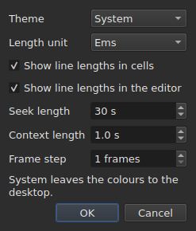

# Les préférences

La fenêtre se souvient de ce qu'on a posé à la souris — **où elle était**, **si
elle était agrandie**, **la largeur de ses colonnes**, **la position de la
poignée** entre le film et la table — et de **là où l'on travaille**, pour que
`Open…` s'ouvre au bon endroit. Rien de tout cela ne se règle par un dialogue :
on déplace, on tire, et c'est retenu.

**Six préférences ont un dialogue à elles**, `Edit ▸ Preferences…`, et c'est le
critère : une préférence qui a déjà un geste n'a pas besoin d'un champ. Le
thème n'en a aucun, ni l'unité des longueurs de lignes, ni les deux cases qui
les montrent, ni le saut et l'avance du lecteur. Voir [Le thème](#le-thème),
[Les longueurs de lignes](#les-longueurs-de-lignes) et [Le lecteur](#le-lecteur).

**Le volume n'en a pas** : la barre sous l'image et deux gestes le règlent, et il est retenu.

**Une autre se règle là où elle sert** : le côté où `Insert Subtitles…` pose ses
lignes est un champ de ce dialogue-là, et le dernier choix est retenu. Voir
[Insérer, supprimer, fusionner et scinder des lignes](lignes.md#le-côté-est-retenu).

**Les deux options de la recherche aussi** : `Regular expression` et
`Ignore case` restent cochées ou décochées d'une ouverture du dialogue à la
suivante, et d'une session à la suivante. Voir
[Rechercher et remplacer](recherche.md#les-deux-options).

**Les réglages d'`Adjust Durations…` aussi** : la vitesse de lecture, ses deux
sens, et les trois durées avec leurs cases — chacune garde sa valeur, cochée ou
non. Voir [`Adjust Durations…`](operations.md#adjust-durations).

**Et le dernier encodage choisi dans `Save As…`**, avec sa marque d'ordre des
octets. Voir [le fichier](#le-fichier).

**Et ce que l'assistant `Correct Texts…` et `Spell-Check Settings…` règlent** : les
tâches cochées et leur code, les cases de motifs, les réglages du découpage, la langue,
la cible de la vérification et le soulignement à la frappe. Voir [Correct Texts…](correct-texts.md) et
[Check Spelling…](verifier-orthographe.md#spell-check-settings). **La cible et le
document de `Correct Texts…` ne sont pas retenus.**

**Ce qui n'est pas retenu :** le dernier fichier ouvert — voir
[Le répertoire retenu](#le-répertoire-retenu).

## Le lecteur

Trois champs. **Seek length** et **Context length** sont ceux de Gaupol et ont ses valeurs ; **Frame step** est propre à subedit :

| Champ | Ce qu'il règle | Par défaut | Bornes |
| :---- | :------------- | ---------: | :----- |
| `Seek length` | le saut de `Seek Backward` et `Seek Forward` | 30 s | de 1 s à une heure |
| `Context length` | l'avance avant la sélection, pour `Seek Selection Start`, `Seek Selection End` et `Play Selection` | 1 s | de 0 à 60 s, au dixième |
| `Frame step` | le pas, **en images**, de `Step Backward` et `Step Forward`, et du décalage d'un bord | 1 image | de 1 à 1000 images |

Ils s'appliquent **à l'instant**, sans attendre un redémarrage, et sont retenus d'une session à l'autre
sous `video.seek-length` (en secondes), `video.context-length-ms` (en millisecondes) et `video.step-frames` (en images).
**Une valeur hors des bornes, ou qui n'est pas un nombre**, n'empêche pas la fenêtre de s'ouvrir : elle
est ignorée, le défaut reste, et la fenêtre le dit à l'ouverture. **Le pas d'image n'est jamais en millisecondes** : un pas de N images est toujours N images, quelle que soit la fréquence du film — voir [Caler depuis la vidéo](calage.md#image-par-image). Le volume est retenu à `video.volume`,
de 0 à 100, avec la même tolérance.

## Le fichier

```
~/.config/subedit/settings.conf
```

Plus exactement `$XDG_CONFIG_HOME/subedit/settings.conf` lorsque cette variable
est posée. Il est écrit **à la fermeture de la fenêtre**, et lu à son ouverture.
Un programme interrompu — tué, ou arrêté par une panne — n'écrit rien, et la
session suivante retrouve ce que la précédente avait laissé.

Le fichier est du texte, et il se modifie à la main. C'est une propriété et non
un effet de bord : c'est ce qui rend un réglage corrigeable quand l'interface
qui le pose est justement celle qui ne va pas.

| Option | Ce qu'elle vaut | Défaut |
| :----- | :-------------- | :----- |
| `window.geometry` | `x,y,largeur,hauteur`, en pixels ; largeur et hauteur non nulles | la fenêtre se dimensionne elle-même |
| `window.maximised` | `true` ou `false` | `false` |
| `table.columns` | quatre largeurs en pixels, séparées par des virgules — `#`, `Start`, `End`, `Duration`, même masquées | la table se dimensionne elle-même |
| `table.order` | les six colonnes, **chacune une fois**, dans l'ordre où la table les montre : `number`, `start`, `end`, `duration`, `text`, `translation` | `number,start,end,duration,text,translation` |
| `table.hidden` | les colonnes retirées, parmi `number`, `start`, `end` et `duration` ; vide, aucune | aucune |
| `window.table-share` | la part de la hauteur donnée à la table, en pour cent, de 1 à 99 | la fenêtre partage comme elle l'a toujours fait |
| `file.directory` | un chemin **absolu** de répertoire | aucun : `Open…` s'ouvre là où le programme a été lancé |
| `general.theme` | `system`, `light` ou `dark` | `system` |
| `edit.insert-placement` | `above` ou `below` | `below` |
| `file.write-encoding` | le nom d'un encodage qu'ICU sait écrire, et dont le convertisseur n'écrit pas sa propre marque | aucun |
| `file.write-bom` | `true` ou `false` | `false` |
| `search.regex` | `true` ou `false` — le motif est une expression régulière | `false` |
| `search.ignore-case` | `true` ou `false` — la casse est ignorée | `true` |
| `duration-adjust.speed` | la vitesse de lecture, en caractères par seconde, strictement positive ; un nombre décimal s'écrit au plus court (`15`, `12.5`) | `15` |
| `duration-adjust.lengthen` | `true` ou `false` — allonger ce qui est trop court pour être lu | `true` |
| `duration-adjust.shorten` | `true` ou `false` — raccourcir ce qui reste affiché plus que nécessaire | `false` |
| `duration-adjust.minimum-enabled` | `true` ou `false` — la durée minimale est demandée | `true` |
| `duration-adjust.minimum-ms` | la durée minimale, en millisecondes, entière et non négative | `1500` |
| `duration-adjust.maximum-enabled` | `true` ou `false` — la durée maximale est demandée | `false` |
| `duration-adjust.maximum-ms` | la durée maximale, en millisecondes, entière et non négative | `6000` |
| `duration-adjust.gap-enabled` | `true` ou `false` — l'écart au sous-titre suivant est demandé | `true` |
| `duration-adjust.gap-ms` | l'écart, en millisecondes, entier et non négatif | `0` |
| `correction.mentions.enabled`, `correction.common-errors.enabled`, `correction.capitalization.enabled`, `correction.line-break.enabled` | `true` ou `false` — la tâche est cochée sur la première page de `Correct Texts…` | `false`, `true`, `true`, `false` |
| `correction.mentions.code`, `correction.common-errors.code`, `correction.capitalization.code`, `correction.line-break.code` | le code des motifs de la tâche : `Zyyy`, ou `Écriture[-langue[-PAYS]]` — `Latn-en-US` ; non vide | `Zyyy` |
| `correction.human`, `correction.ocr` | `true` ou `false` — les classes des erreurs courantes | `true`, `true` |
| `correction.sound-in-brackets`, `correction.sound-in-parentheses` | `true` ou `false` — les deux cases de la page `Mentions` | `false`, `false` |
| `correction.line-break.max-length` | la longueur maximale d'une ligne, décimale ; le dialogue la borne de 1 à 1000 | `24` |
| `correction.line-break.max-lines` | le nombre de lignes maximal, entier ; le dialogue le borne de 1 à 100 | `3` |
| `correction.line-break.in-ems` | `true` : la longueur se mesure en *ems* ; `false` : en caractères | `true` |
| `correction.line-break.skip-on-length`, `correction.line-break.skip-on-lines` | `true` ou `false` — les deux conditions de saut sont demandées | `true`, `true` |
| `correction.line-break.skip-max-length`, `correction.line-break.skip-max-lines` | les deux seuils du saut, dans l'unité choisie | `24`, `3` |
| `correction.join-split.enabled` | `true` ou `false` — la tâche `Join or Split Words` est cochée | `false` |
| `correction.join-split.join`, `correction.join-split.split` | `true` ou `false` — recoller, scinder | `true`, `false` |
| `correction.join-split.language` | un code de locale — `fr`, `en_US`, `sr@Latn` — ; vide : la langue du système | vide |
| `correction.remove-blank` | `true` ou `false` — `Remove all blank subtitles` | `true` |
| `correction.activations` | les cases de motifs que l'utilisateur a changées, `<type>:<code>:<nom>:<0\|1>`, séparées par des virgules ; **une virgule ou une barre oblique inverse dans un nom s'écrit précédée d'une barre oblique inverse** (`\,` et `\\`), et une entrée illisible ne fait perdre que son propre réglage — elle est signalée, les autres sont gardées | vide |
| `spell-check.language` | un code de locale, tel que `fr_FR` ; vide : la langue du système | vide |
| `spell-check.target` | `selection`, `current-project` ou `all-projects` | `current-project` |
| `spell-check.document` | `main` ou `translation` | `main` |
| `spell-check.inline` | `true` ou `false` — souligner les mots inconnus pendant qu'on tape dans l'éditeur d'une cellule | `false` |
| `editor.length-unit` | `em` ou `characters` — l'unité des longueurs de lignes montrées par la table et l'éditeur | `em` |
| `editor.show-lengths-cell` | `true` ou `false` — chaque ligne d'une cellule de texte est suivie de sa longueur | `true` |
| `editor.show-lengths-edit` | `true` ou `false` — l'éditeur d'une cellule montre la longueur de chaque ligne dans une marge | `true` |

**Le fichier accepte plus large que le dialogue.** Le lecteur prend toute vitesse
strictement positive et toute durée non négative ; le dialogue d'`Adjust
Durations…`, lui, borne la vitesse de 1 à 99 caractères par seconde et chaque
durée de 0 à 99 s. Une valeur du fichier hors de ces bornes est ramenée à la
borne quand le dialogue s'ouvre, et le fichier la garde ainsi une fois le
dialogue validé et la fenêtre fermée. Un dialogue annulé ne change rien à ce
qui est retenu.

**`file.write-encoding` retient le dernier encodage choisi dans `Save As…`, et
ne s'impose jamais à un fichier.** Un document ouvert porte son propre encodage,
et c'est celui-là que la boîte propose : le réécrire dans un autre parce qu'un
réglage vieux de trois semaines le dit serait perdre ce que la lecture a gardé.
Ce dont ce réglage se souvient sert au document qui n'a pas de fichier — celui
qu'on vient de créer.

**C'est un « non » assumé et non un oubli.** Quelqu'un qui livre toujours dans
le même encodage et ouvre des fichiers hérités dans un autre le rechoisit à
chaque fichier ; la boîte le lui propose, et la garantie d'aller-retour vaut
pour tout le monde.

**`file.write-bom` porte la marque du même encodage**, et il en faut bien deux
lignes : le nom d'un encodage ne dit pas s'il est précédé de sa marque, pas plus
que `--encoding` ne dit ce que `--bom` dit. Les deux se lisent ensemble, dans
l'ordre qu'on veut, et un `file.write-bom` sans encodage retenu ne pose rien.

**Une part et non des hauteurs pour la poignée**, et c'est ce qui la rend
utile : trois hauteurs en pixels ne veulent plus rien dire dès que la fenêtre
s'ouvre à une autre taille, et une fenêtre s'ouvre souvent à une autre taille.
La part se rejoue partout. Elle est **ramenée à ce que la fenêtre accepte** si
elle est trop petite — la bande du film a une hauteur minimale.

**Quatre largeurs pour six colonnes**, et ce n'est pas un oubli : ce sont celles
de `#`, `Start`, `End` et `Duration`, dans cet ordre quel que soit celui de la
table, et **une colonne masquée garde la sienne** — elle la retrouve quand on la
remontre. La dernière colonne montrée prend ce que les autres laissent, et lui
donner une largeur ne ferait rien ; celles du texte et de la traduction ne se
retiennent donc pas.

## Ce qui arrive quand le fichier ne dit pas ce qu'on attend

Une configuration est un confort. **Sa défaillance coûte le confort et rien
d'autre** : la fenêtre s'ouvre dans tous les cas.

| Cas | Ce qui se passe |
| :-- | :-------------- |
| le fichier n'existe pas | tous les défauts, et rien n'est dit — c'est le premier lancement |
| le fichier existe et ne se lit pas | tous les défauts, et la raison est écrite sur la sortie d'erreur |
| une option est absente | son défaut |
| une clé est inconnue | ignorée, sans un mot, et absente du fichier réécrit |
| une valeur ne se lit pas | son défaut est gardé, et l'option est nommée sur la sortie d'erreur |

```console
$ subedit-gui film.srt
subedit-gui: /home/vous/.config/subedit/settings.conf: window.geometry: "plus tard" cannot be read, keeping the default
```

**Le message va sur la sortie d'erreur et nulle part ailleurs.** Une fenêtre
modale au démarrage pour une préférence illisible arrêterait l'utilisateur pour
un défaut qui ne l'empêche de rien, et avant qu'il ait rien demandé.

## Les options commentées

Le fichier réécrit contient **toutes** les options connues, et celles restées à
leur défaut sont écrites en commentaire :

```
#window.geometry = 0,0,1280,800
#window.maximised = false
#table.columns = 60,110,110,110
#table.order = number,start,end,duration,text,translation
#table.hidden = start,end
```

Ce n'est pas une coquetterie. Sans cela, une option jamais touchée resterait
figée à la valeur du jour où elle a été écrite, et **un défaut qu'on améliore
n'atteindrait jamais personne**. Avec cela, changer un défaut change le
comportement de tous ceux qui ne l'ont pas surchargé — ce qui est très
exactement ce qu'un défaut doit faire.

Pour surcharger une option : retirer le `#` et changer la valeur. Pour revenir
au défaut : effacer la ligne, ou la remettre en commentaire.

La géométrie, les largeurs et les colonnes retirées montrent une **forme** et
non une valeur en vigueur : le défaut de la géométrie et celui des largeurs sont
« ce que la fenêtre choisit », qui ne s'écrit pas en nombres, et celui de
`table.hidden` est « aucune », qui ne se lit pas. L'en-tête du fichier le dit
aussi. `table.order`, lui, montre bien l'ordre par défaut.

## Le répertoire retenu

`Open…` s'ouvre sur le répertoire du **dernier fichier ouvert ou enregistré**,
et non sur celui d'une boîte qu'on a annulée : ce qui compte est là où l'on
travaille, pas là où l'on a regardé.

**Le dernier fichier, lui, n'est pas retenu.** S'en souvenir voudrait dire
rouvrir au lancement un document que personne n'a demandé. Retenir un répertoire
*pointe* une boîte de dialogue ; retenir un fichier en ouvrirait un.

## Le thème

`Edit ▸ Preferences…` ouvre le thème, préférence sans geste, au-dessus des
[longueurs de lignes](#les-longueurs-de-lignes).

| Valeur | Ce qu'elle fait |
| :----- | :-------------- |
| `System` | **rien** — les couleurs restent celles du bureau |
| `Light` | pose une palette claire |
| `Dark` | pose une palette sombre |

Le thème choisi s'applique **immédiatement**, sans redémarrer.

**« System » ne fait rien, et ce n'est pas un manque.** La version de Qt sur
laquelle subedit est bâti n'a aucun moyen de demander au bureau s'il se veut
clair ou sombre, ni d'être prévenue quand il change d'avis. Plutôt que
d'inventer une lecture qu'on ne sait pas faire, l'outil livre les deux thèmes
qu'on peut demander et laisse la boîte à outils décider pour le troisième —
ce que fait Gaupol sous les mêmes conditions.

Sous un bureau dont le thème est déjà sombre, `System` donne donc une fenêtre
sombre ; sous un bureau clair, une fenêtre claire. `Light` et `Dark` passent
outre, quel que soit le bureau.

**Les teintes d'anomalie restent lisibles dans les deux palettes** — voir
[La table](table.md#les-anomalies). Ce n'est pas une supposition : le contraste
du texte sur chacune des teintes est vérifié par un test, sur les deux fonds.

## Les longueurs de lignes




`Edit ▸ Preferences…` règle aussi **ce que la table et l'éditeur montrent de la
longueur des lignes** — la règle et la marge de Gaupol.

| Champ | Ce qu'il fait | Défaut |
| :---- | :------------ | :----- |
| `Length unit` | l'unité des longueurs : `Ems` ou `Characters` | `Ems` |
| `Show line lengths in cells` | chaque ligne d'une cellule de texte est suivie de sa longueur | coché |
| `Show line lengths in the editor` | l'éditeur d'une cellule montre la longueur de chaque ligne dans une marge à droite | coché |

**`Length unit` est grisé quand aucune des deux cases n'est cochée** : sans
longueur à montrer, l'unité ne règle rien. Le choix s'applique **aussitôt** à la
table, et les éditeurs qui s'ouvrent ensuite le suivent. Les trois valeurs sont
retenues d'une session à l'autre : `editor.length-unit`, `editor.show-lengths-cell`
et `editor.show-lengths-edit`, dans le tableau [du fichier](#le-fichier). Voir
[La longueur des lignes](table.md#la-longueur-des-lignes) et
[dans l'éditeur](edition.md#la-longueur-des-lignes).

**Ce n'est pas la limite de l'assistant.** L'unité de `Correct Texts…` — la
longueur à laquelle il coupe les lignes — est un réglage à part, dans son
assistant : on peut lire des ems dans la table et couper en caractères.

## Ce qui ne se règle pas

**Neuf réglages retenus se choisissent dans un dialogue** — sans compter ceux de
l'assistant de correction et de la vérification orthographique, qui ont chacun le
leur —, et chacun dans celui où il sert : le thème et les trois réglages des longueurs de lignes, ici ; le côté d'une insertion, dans le dialogue d'insertion ;
les deux options de la recherche, dans le dialogue de recherche ; l'encodage et
la marque d'ordre des octets, dans `Save As…` ; la vitesse de lecture, les durées
et l'écart de l'ajustement des durées, dans son propre dialogue. Il n'y en a pas
d'autre : rien ne se règle pour les diagnostics, le volume du lecteur,
ni le format d'enregistrement par défaut — celui-ci vient du fichier ouvert.

Et **aucun nombre qui appartient à un document n'est gardé d'une session à
l'autre** : une durée de décalage, deux repères de transformation sont vrais d'un
fichier et faux du suivant. Les dialogues les redemandent à chaque lancement,
délibérément. Les réglages d'`Adjust Durations…` font exception au même titre que
les deux options de la recherche : une vitesse de lecture, une durée minimale ou
un écart sont des choix de méthode plutôt que des mesures d'un fichier, et
persistent d'une session à l'autre pour cette raison.

Ce manuel décrit ce qui existe : ce qui viendra est dans la
[feuille de route](../../feuille-de-route.md).
