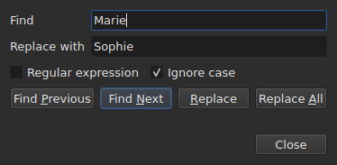

# Rechercher et remplacer

`Edit ▸ Find and Replace…`, ou `Ctrl+F`, ouvre le dialogue de recherche.

**Le dialogue n'est pas modal** : il reste ouvert pendant qu'on regarde la table,
qu'on édite une cellule, qu'on recherche encore. `Close` le ferme ; le rouvrir le
rend tel qu'on l'avait laissé, motif et remplacement compris.

| Champ | Ce qu'il porte |
| :---- | :------------- |
| `Find` | le motif cherché |
| `Replace with` | ce qui le remplace |
| `Regular expression` | le motif est une expression régulière plutôt qu'un texte simple |
| `Ignore case` | « marie » trouve « Marie » |

L'entrée est éteinte sur un document vide : il n'y a rien à chercher.

## Les quatre gestes

| Bouton | Ce qu'il fait |
| :----- | :------------ |
| `Find Previous` | trouve la correspondance précédente, et la table s'y rend |
| `Find Next` | trouve la suivante — c'est le bouton qu'`Entrée` presse |
| `Replace` | remplace la correspondance trouvée, puis trouve la suivante |
| `Replace All` | remplace toutes celles de la cible |

Les quatre sont éteints tant que `Find` est vide.

**La table se rend à la correspondance** en sélectionnant sa ligne. Arrivée à la
dernière, `Find Next` repart de la première ; `Find Previous` fait de même dans
l'autre sens.

**`Replace` sans correspondance trouvée cherche d'abord** : la première pression
montre ce qui va être remplacé, la suivante le remplace. C'est ce que fait
Gaupol.

## Sur quoi porte la recherche

**La sélection, ou tout le document si rien n'est sélectionné** — la règle du
menu `Tools`. Voir [Les opérations](operations.md#sur-quoi-elles-portent).

**La cible est prise au premier geste et gardée** tant que la recherche se
poursuit : `Find Next` sélectionne la ligne d'une correspondance, et cette
sélection-là ne rétrécit pas la cible. **Sélectionner soi-même d'autres lignes
change la cible** pour le geste suivant.

La recherche porte sur le texte des sous-titres ; ni les positions ni le numéro
ne sont cherchés.

**Ce qui fait repartir de zéro** :

| Geste | Ce qui est oublié |
| :---- | :---------------- |
| modifier `Find`, `Replace with` ou une option | la correspondance courante, et la ligne d'état |
| sélectionner soi-même d'autres lignes | la cible et la correspondance |
| ouvrir un autre fichier | la cible et la correspondance ; le dialogue reste ouvert, motif compris |

## Le texte cherché est le texte visible

**Les balises ne sont pas du texte.** Chercher `<i>` ne trouve rien, et chercher
`Bonjour` trouve un `<i>Bon</i>jour` coupé par une balise.

**Le remplacement se fait dans le texte du fichier, sans casser les balises** :

| Texte | Cherché → mis à la place | Ce qui est écrit |
| :---- | :----------------------- | :--------------- |
| `<i>Bonjour</i>` | `Bonjour` → `Salut` | `<i>Salut</i>` |
| `<i>Bon</i>jour` | `Bonjour` → `Salut` | `<i>Salut</i>` |
| `<i>Bonjour</i> Marie` | `Bonjour Marie` → `Salut Sophie` | `<i>Salut Sophie</i>` |

Une balise qui coupe un mot englobe le mot entier, et tout style qui touche la
correspondance couvre le remplacement. **Les balises que la correspondance ne
touche pas restent où elles sont**, même celle qui coupe un autre mot du même
sous-titre : remplacer `Marie` dans `<i>Bon</i>jour Marie` donne
`<i>Bon</i>jour Sophie`. Un mot est fait de lettres et de chiffres — une espace
insécable ou un guillemet n'en font pas partie. **`Replace with` se lit dans les balises du
document** : y taper `<b>Salut</b>` dans un SubRip met le mot en gras.

## Les deux options

| Option | Défaut | Ce qu'elle change |
| :----- | :----- | :---------------- |
| `Regular expression` | non cochée | `.` ne cherche plus un point mais n'importe quel caractère |
| `Ignore case` | cochée | la casse ne compte pas, lettres accentuées comprises : `élise` trouve `Élise` |

Ce sont les défauts de Gaupol. **Les deux sont retenues** d'une ouverture à
l'autre et d'une session à l'autre, dans les options `search.regex` et
`search.ignore-case` du [fichier de préférences](preferences.md#le-fichier).

### Une expression régulière

Le motif est lu par ICU. Comme chez Gaupol, `.` traverse un saut de ligne, et `^`
et `$` valent au début et à la fin **de chaque ligne** d'un sous-titre :
remplacer `^` par `- ` pose un tiret devant chaque ligne.

Dans `Replace with`, et seulement pour une expression régulière :

| Écrit | Ce qu'il met |
| :---- | :----------- |
| `$1` à `$9` | le groupe de ce numéro ; un groupe absent ne met rien |
| `$0` | toute la correspondance |
| `\n` | un saut de ligne |
| `\$`, `\\` | un `$`, une barre oblique inverse |
| `\` suivi de tout autre caractère | ce caractère : `\t` met un `t` |

**`\1` n'est pas un groupe**, et met un `1`. C'est la syntaxe de Gaupol, qui lit
ses expressions en Python ; celle d'ici est celle d'ICU, qui lit le motif.

## Ce que le dialogue dit

Sous les boutons, une ligne dit ce que la recherche n'a pas pu faire, ou ce qu'un
`Replace All` a fait :

| Situation | Ce qui s'affiche |
| :-------- | :--------------- |
| aucune correspondance dans la cible | `"Sophie" not found` |
| une expression régulière qui ne se lit pas | `not a regular expression (U_REGEX_MISMATCHED_PAREN)` |
| `Replace All` a remplacé | `replaced 3 matches` |
| `Replace All` a trouvé le motif, mais le remplacement ne change aucun texte | `nothing to change` |

**Une recherche qui ne trouve rien ne touche à rien** : la sélection reste où
elle était, et rien n'entre dans l'historique.

**`not found` et `nothing to change` ne disent pas la même chose.** `not found`
dit que le motif n'est nulle part dans la cible. `nothing to change` dit qu'il
y est, mais que le remplacement laisse chaque texte tel qu'il était — remplacer
`Marie` par `Marie`, par exemple. Dans les deux cas rien n'entre dans
l'historique. Le nombre de `replaced N matches` compte les correspondances des
sous-titres dont le texte a changé.

## Ce que l'action d'annulation en dit

| Geste | Ce que `Undo` lit |
| :---- | :---------------- |
| `Replace` | `Undo: replacing` — un par remplacement |
| `Replace All` | `Undo: replacing all` — **une seule entrée**, quel que soit le nombre de correspondances |

Voir [Annuler et rétablir](annulation.md).
