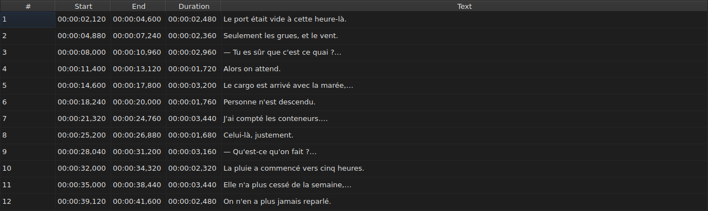

# La table

La fenêtre montre les sous-titres du fichier ouvert, un par ligne, dans cinq
colonnes.

**La fenêtre est en anglais**, comme la ligne de commande. La traduction est
une phase à elle seule ; ce manuel cite donc les intitulés tels qu'ils
s'affichent.

| Colonne | Ce qu'elle montre |
| :------ | :---------------- |
| `#` | le rang du sous-titre, à partir de 1 |
| `Start` | la position d'apparition, `HH:MM:SS,mmm` |
| `End` | la position de disparition |
| `Duration` | `End − Start` |
| `Text` | le texte du sous-titre |

**Le numéro n'est pas une donnée du fichier** mais le rang de la ligne. Une
insertion ou une suppression renumérote donc tout ce qui suit, sans que rien ne
soit réécrit.

**Le séparateur décimal suit le format du fichier** : une virgule pour SubRip,
un point pour WebVTT. Ce qui s'affiche est ce qui sera écrit.

**La durée (`Duration`) est calculée**, jamais saisie. Un sous-titre dont la fin précède le
début affiche une durée négative plutôt que zéro : c'est une anomalie du
fichier, et la masquer la rendrait introuvable.

**Le début, la fin et le texte s'éditent en place** ; le numéro et la durée non.
Voir [Éditer une cellule](edition.md).

**La sélection désigne ce sur quoi une opération porte** — voir
[Les opérations](operations.md).

**Un texte de plusieurs lignes n'en montre qu'une** : la hauteur des lignes de
la table est fixe, et le reste est coupé à l'affichage. Rien n'est perdu — le
texte entier réapparaît dès qu'on ouvre la cellule, et c'est lui qui sera
écrit.

## Les anomalies

Un sous-titre dont les positions ne tiennent pas debout est **teinté sur ses
colonnes de temps**, et le survoler dit ce qui ne va pas.

| Teinte | Ce qu'elle signale | Ce qu'il faut faire |
| :----- | :----------------- | :------------------ |
| rouge | `ends before it starts` | corriger sa fin, ou son début |
| bleue | `starts before the previous one starts` | le remettre à sa place dans l'ordre |
| ambre | `starts before the previous one ends` | ajuster son calage |

Seules les colonnes `Start`, `End` et `Duration` sont teintées : une anomalie ne
parle que de temps, et teinter le texte laisserait croire qu'il y est pour
quelque chose.

**Un sous-titre peut en porter plusieurs**, et l'infobulle les nomme toutes. La
teinte est celle de la première à réparer : un sous-titre cassé en lui-même
l'est quoi que fassent ses voisins ; un sous-titre mal placé se remet en place,
et son chevauchement s'en va avec lui.

> Ce n'est pas un hasard si le désordre l'emporte presque toujours sur le
> chevauchement : commencer avant que le précédent ne commence, c'est commencer
> avant qu'il ne finisse — sauf si le précédent est lui-même cassé.

**Le marquage se recalcule après chaque changement de position**, qu'il vienne
d'une cellule éditée, d'une opération ou d'une annulation. Il dit ce que le
fichier est maintenant, pas ce qu'il était à l'ouverture.

Il ne s'appuie sur aucune grille d'images : dès qu'une position est corrigée à
la main, elle en sort, et un marquage fondé dessus signalerait le travail de
l'utilisateur.

## Ajouter et retirer des lignes

`Edit ▸ Insert Subtitles…` et `Edit ▸ Remove Subtitles` posent et retirent des
lignes ; la table se renumérote toute seule. Voir
[Insérer et supprimer des lignes](lignes.md).

## Ce que la table ne fait pas

**Le tri par colonne n'existe pas.** L'ordre affiché est celui du fichier, et
c'est le seul qui ait un sens pour des sous-titres : le rang d'une ligne *est*
sa place dans le temps.
