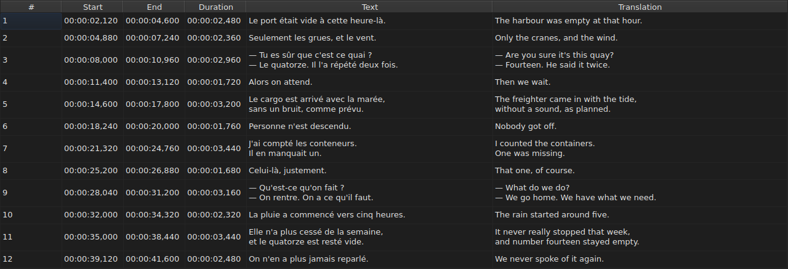
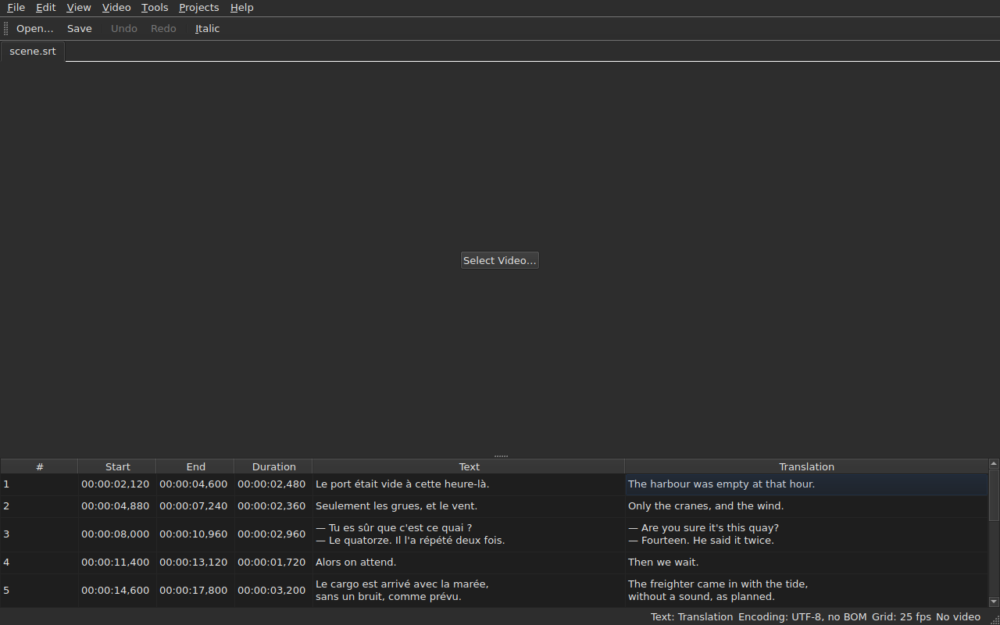

# La table

La fenêtre montre les sous-titres du fichier ouvert, un par ligne, dans cinq
colonnes — six quand le projet porte une traduction.

**La fenêtre est en anglais**, comme la ligne de commande. La traduction est
une phase à elle seule ; ce manuel cite donc les intitulés tels qu'ils
s'affichent.

| Colonne | Ce qu'elle montre |
| :------ | :---------------- |
| `#` | le rang du sous-titre, à partir de 1 |
| `Start` | la position d'apparition, `HH:MM:SS,mmm` |
| `End` | la position de disparition |
| `Duration` | `End − Start` |
| `Text` | le texte du sous-titre |
| `Translation` | la traduction du sous-titre — **absente tant que le projet n'en a pas** |


**Le numéro n'est pas une donnée du fichier** mais le rang de la ligne. Une
insertion ou une suppression renumérote donc tout ce qui suit, sans que rien ne
soit réécrit.

**Le séparateur décimal suit le format du fichier** : une virgule pour SubRip,
un point pour les huit autres. SubRip est le seul des neuf à écrire une virgule.

**C'est le séparateur qui suit, pas l'orthographe entière.** La table écrit
toujours les heures et toujours trois décimales ; un fichier WebVTT omet les
heures sous une heure, SubViewer 2 et les deux Sub Station Alpha comptent au
centième, MPL2 au dixième, TMPlayer à la seconde, MicroDVD en images. Une
colonne dont la largeur suivrait le format serait plus pénible à lire qu'une
colonne qui n'est simplement pas l'orthographe exacte du fichier.

Ce que la table garantit est donc **la valeur et le séparateur**, non le nombre
de décimales. Ce qu'un format d'arrivée arrondirait est dit au moment de
l'enregistrement — voir
[Ce qu'un format ne portera pas](fichiers.md#ce-quun-format-ne-portera-pas-dit-avant-décrire).

**La durée (`Duration`) est calculée**, jamais stockée : la saisir déplace la
fin. Un sous-titre dont la fin précède le
début affiche une durée négative plutôt que zéro : c'est une anomalie du
fichier, et la masquer la rendrait introuvable.

**Le début, la fin, la durée, le texte et la traduction s'éditent en place** ; le
numéro non. Voir [Éditer une cellule](edition.md).

**La sélection désigne ce sur quoi une opération porte** — voir
[Les opérations](operations.md).

**La hauteur d'une ligne suit le sous-titre qu'elle porte** : un sous-titre de
deux lignes en occupe deux, un de trois en occupe trois. Le texte est montré en
entier, tel qu'il sera écrit.

**Ce qui reste coupé est une ligne trop longue pour sa colonne**, et elle se
termine alors par une ellipse. Élargir la colonne `Text`, ou la fenêtre, la
montre en entier ; ouvrir la cellule aussi. Les lignes du texte ne sont jamais
repliées : seul un vrai saut de ligne fait une ligne, si bien que la hauteur
d'une ligne de la table ne change pas quand on tire le bord d'une colonne.

## Les anomalies

Un sous-titre dont les positions ne tiennent pas debout est **teinté sur ses
colonnes de temps**, et le survoler dit ce qui ne va pas.

| Teinte | Ce qu'elle signale | Ce qu'il faut faire |
| :----- | :----------------- | :------------------ |
| rouge | `ends before it starts` | corriger sa fin, ou son début |
| bleue | `starts before the previous one starts` | le remettre à sa place dans l'ordre |
| ambre | `starts before the previous one ends` | ajuster son calage |


Seules les colonnes `Start`, `End` et `Duration` sont teintées : une anomalie ne
parle que de temps, et teinter le texte laisserait croire qu'il y est pour
quelque chose.

**Un sous-titre peut en porter plusieurs**, et l'infobulle les nomme toutes. La
teinte est celle de la première à réparer : un sous-titre cassé en lui-même
l'est quoi que fassent ses voisins ; un sous-titre mal placé se remet en place,
et son chevauchement s'en va avec lui.

> Ce n'est pas un hasard si le désordre l'emporte presque toujours sur le
> chevauchement : commencer avant que le précédent ne commence, c'est commencer
> avant qu'il ne finisse — sauf si le précédent est lui-même cassé.

**Le marquage se recalcule après chaque changement de position**, qu'il vienne
d'une cellule éditée, d'une opération ou d'une annulation. Il dit ce que le
fichier est maintenant, pas ce qu'il était à l'ouverture.

Il ne s'appuie sur aucune grille d'images : dès qu'une position est corrigée à
la main, elle en sort, et un marquage fondé dessus signalerait le travail de
l'utilisateur.

## La colonne de traduction

Un sous-titre porte **deux textes et une seule paire de positions** : la
traduction n'a pas de calage à elle, elle est rattachée à celui du sous-titre.
La table la montre dans une sixième colonne, `Translation`, à droite de `Text`.




**La colonne n'est là que si le projet a une traduction.** Sans elle, la table
garde ses cinq colonnes, et la fenêtre se comporte comme si la traduction
n'existait pas — rien n'est grisé ni ajouté. `File ▸ Open Translation…` en ouvre
une : voir [Ouvrir une traduction](fichiers.md#ouvrir-une-traduction).

**Une entrée du menu `View` la montre ou la retire** :

| Entrée | Ce qu'elle fait |
| :----- | :-------------- |
| `View ▸ Translation` | coche : la colonne est montrée ; décoche : elle est retirée |

L'entrée est **éteinte quand le projet n'a pas de traduction** — il n'y a rien à
montrer — et cochée au démarrage. **Le choix de la retirer est celui de
l'utilisateur** : il tient d'un fichier à l'autre, jusqu'à ce qu'on la coche de
nouveau. Retirer la colonne ne retire pas la traduction : elle reste dans le
projet, et revient avec l'entrée. Ouvrir un fichier qui n'en porte pas retire la
colonne.

**Les cellules de la traduction se saisissent comme celles du texte** — voir
[Éditer une cellule](edition.md).

### Le texte que les opérations visent

Avec deux textes dans une ligne, les opérations de texte doivent savoir lequel
elles réécrivent. **C'est celui de la colonne de la cellule courante** : la
traduction si la cellule courante est dans la colonne `Translation`, le texte
principal partout ailleurs — dans une colonne de temps comme dans `Text`.

| Opération | Ce qu'elle vise |
| :-------- | :-------------- |
| `Italic`, `Case`, `Dialogue`, `Remove Hearing-Impaired Mentions…` | le texte de la colonne courante |
| `Cut Texts`, `Copy Texts`, `Paste Texts` | le texte de la colonne courante |
| les opérations de position, l'insertion, la suppression, la fusion, la scission | **les deux textes** : un sous-titre est un tout |

**La barre d'état le dit quand il y a deux textes**, à gauche des autres
indications :

```text
Text: Translation
```

ou `Text: Main` pour le texte principal. Elle se tait quand la colonne n'est pas
montrée : il n'y a alors qu'un texte, et ce n'est pas la peine de le dire.




**Rien n'est grisé.** Les opérations de texte restent disponibles quelle que soit
la colonne courante, et sans colonne de traduction elles visent le texte
principal, comme avant.

## Ajouter et retirer des lignes

`Edit ▸ Insert Subtitles…` et `Edit ▸ Remove Subtitles` posent et retirent des
lignes, `Edit ▸ Merge Subtitles` et `Edit ▸ Split Subtitle` en fusionnent et en
scindent ; la table se renumérote toute seule. Voir
[Insérer, supprimer, fusionner et scinder des lignes](lignes.md).

## Ce que la table ne fait pas

**Le tri par colonne n'existe pas.** L'ordre affiché est celui du fichier, et
c'est le seul qui ait un sens pour des sous-titres : le rang d'une ligne *est*
sa place dans le temps.
