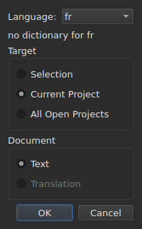
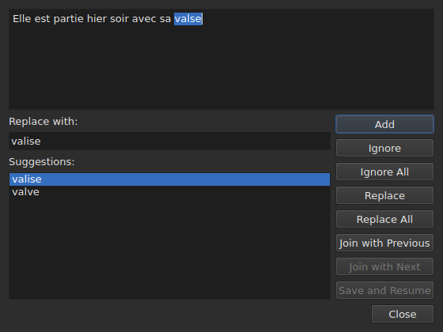

# Check Spelling…

`Tools ▸ Check Spelling…` parcourt les mots que le dictionnaire ne connaît pas,
un à la fois, sur le modèle du correcteur de Gaupol. Elle a une compagne,
`Tools ▸ Spell-Check Settings…`, qui règle la langue, la cible et le document.
Les deux s'appuient sur les dictionnaires du système, par Enchant.

Le libellé de la première s'écrit `Chec&k Spelling…` : `C` est déjà
l'accélérateur de `Correct Texts…`, et `k` est libre dans le menu `Tools`.
Aucune des deux n'a de raccourci.

**Les deux sont éteintes sur un document vide.** `Check Spelling…` est en plus
éteinte sans dictionnaire pour la langue réglée, voir
[Sans dictionnaire](#sans-dictionnaire).

## Spell-Check Settings…




| Groupe | Choix | Par défaut |
| :----- | :---- | :--------- |
| `Language` | les codes de langue que le système propose, et celui déjà choisi | la langue du système, si elle y est |
| `Target` | `Selection`, `Current Project`, `All Open Projects` | `Current Project` |
| `Document` | `Text`, `Translation` | `Text` |

`Selection` est éteinte sans ligne choisie dans l'onglet montré ; `Translation`
est éteinte tant qu'aucun projet ouvert ne porte de traduction. Un réglage
retenu qui n'est plus disponible — une sélection vide, une traduction absente —
s'ouvre sur `Current Project` ou `Text`. `OK` garde les réglages, `Cancel` ne
change rien.

**Cette fenêtre reste toujours active** dès qu'un projet est ouvert : c'est elle
qui permet de sortir d'une langue sans dictionnaire. La langue dont aucun
dictionnaire n'existe reste modifiable et se montre dans la liste, avec, sous
elle, la phrase `no dictionary for` suivi de son code.

**Les trois réglages se retiennent** d'une session à l'autre, dans le fichier
de réglages de `subedit` — voir [Les préférences](preferences.md) pour son
emplacement :

| Clé | Valeurs | Par défaut |
| :-- | :------ | :--------- |
| `spell-check.language` | un code de langue, tel que `fr_FR` ; vide : la langue du système | vide |
| `spell-check.target` | `selection`, `current-project`, `all-projects` | `current-project` |
| `spell-check.document` | `main`, `translation` | `main` |

Une valeur que la clé n'accepte pas est ignorée, le défaut s'applique, et la
ligne est nommée à l'ouverture.

## Le parcours




La fenêtre montre le texte du sous-titre où elle s'est arrêtée, le mot inconnu
sélectionné dedans. **À chaque mot inconnu, l'onglet du projet revient et la
ligne du sous-titre se sélectionne dans la table.** Le parcours va sous-titre
après sous-titre, puis projet après projet quand la cible en désigne plusieurs.

Sous le texte : la case `Replace with:`, remplie de la première suggestion, et la
liste `Suggestions:`. Choisir une suggestion la copie dans la case ; taper dans la
case renouvelle la liste.

| Bouton | Ce qu'il fait |
| :----- | :------------ |
| `Add` | ajoute le mot au dictionnaire personnel de l'utilisateur et passe au suivant |
| `Ignore` | laisse ce mot et passe au suivant |
| `Ignore All` | laisse ce mot, et toutes ses autres occurrences pendant ce parcours |
| `Replace` | remplace le mot par le contenu de `Replace with:` ; éteint tant que la case est vide |
| `Replace All` | fait de même pour ses autres occurrences ; éteint tant que la case est vide |
| `Join with Previous` | recolle le mot au mot qui le précède ; éteint s'il n'y en a pas, ou s'ils ne sont pas séparés par une espace |
| `Join with Next` | recolle le mot au mot qui le suit, sous les mêmes conditions |
| `Save and Resume` | garde le texte tel que la zone de texte le porte, et reprend le parcours à son début |
| `Close` | ferme la fenêtre |

**La zone de texte est éditable.** Dès qu'on y tape, seul `Save and Resume`
reste actif : les autres gestes portent sur le mot choisi, qui n'est plus
celui du texte.

**Le parcours se termine de lui-même** quand il n'y a plus de mot inconnu : les
boutons s'éteignent, le texte se vide. Une cible sans aucun mot inconnu ne
montre aucune fenêtre.

### Fermer au milieu

`Close`, ou la croix de la fenêtre, **applique ce qui a été fait**, comme la fin
du parcours : les textes déjà quittés, **et** les gestes — remplacer,
tout remplacer, recoller — déjà posés sur le texte courant. C'est un écart de
Gaupol, qui perd le texte courant. Ne comptent ni ce qui reste du parcours, ni
les retouches tapées dans la zone de texte que `Save and Resume` n'a pas
validées.

**Une seule entrée d'historique par projet touché**, quel que soit le nombre de
remplacements : `Undo` défait d'un coup toutes les corrections de ce projet.
Le menu la nomme `Undo: correcting texts`. La barre d'état dit ensuite le
compte :

```text
Edited 2 and removed 0 subtitles
```

**La liste de remplacements** — ce que l'utilisateur a remplacé, et par quoi —
s'écrit à la fermeture dans `spell-check/<langue>.repl`, sous le répertoire de
configuration de `subedit`, et non dans celui de Gaupol, qui n'est jamais lu.
Elle compte ensuite parmi les suggestions du correcteur, ici comme dans
[`Correct Texts…`](correct-texts.md#join-or-split-words--recoller-et-scinder-daprès-le-correcteur).
Si elle ne peut pas s'écrire, une boîte d'erreur le dit, `Could not save the
replacements for` suivi de la langue et de la raison, sans annuler les
corrections.

## Sans dictionnaire

Quand la langue réglée — celle du système, si aucune n'a été choisie — n'a pas
de dictionnaire, **`Check Spelling…` s'éteint**, et sa bulle comme la barre
d'état, quand l'entrée est survolée, disent pourquoi :

```text
no dictionary for fr
```

`Spell-Check Settings…` reste, pour choisir une langue qui en a un. Une fenêtre
construite sans aucun fournisseur de dictionnaires dit la même chose et ne
vérifie rien.

## Les messages

| Message | Où | Ce qui le déclenche |
| :------ | :- | :------------------ |
| `no dictionary for <langue>` | bulle et barre d'état | pas de dictionnaire pour la langue réglée |
| `Nothing to check.` | barre d'état | la cible ne désigne aucun texte — une sélection vide, par exemple |
| `Edited N and removed M subtitles` | barre d'état | à la fin ou à la fermeture ; `M` reste à `0` |
| `Could not save the replacements for <langue>: <raison>` | boîte d'erreur | la liste de remplacements ne s'est pas écrite |

## Un exemple

Un fichier ouvert porte `Elle est partie hier soir avec sa valse`. Le dictionnaire
français est là : `Tools ▸ Check Spelling…` s'arrête sur `valse`, sélectionne la
ligne dans la table, et propose `valise`, déjà dans `Replace with:`. `Replace`
puis `Close` : la ligne devient `Elle est partie hier soir avec sa valise`, et la
barre d'état dit :

```text
Edited 1 and removed 0 subtitles
```
